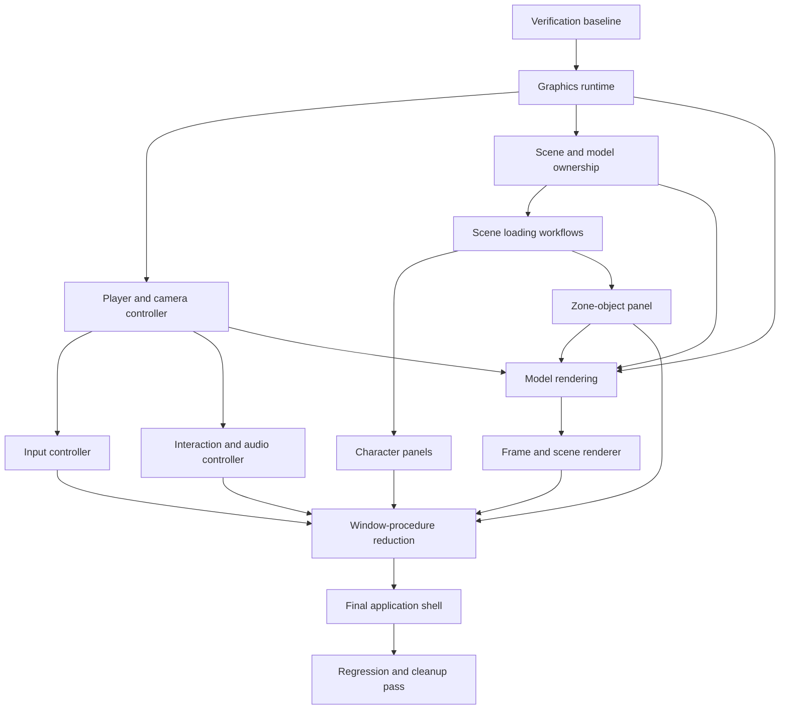

# DATura Refactoring Remainder Plan

**Document date:** September 4, 2026

**Project:** DATura — FFXI Model Viewer

**Status:** Active refactor, approximately 95–97% complete

**Estimated remaining work:** 2–4 careful implementation phases, likely subdivided into smaller reviewable slices, plus final interactive regression hardening

**Latest completed implementation:** Slice 11c, legacy renderer audit and removal (September 4, 2026)

## 1. Purpose

This document records the current state of the DATura project refactor and defines the plan for completing it. It is intended to serve as the durable roadmap for future refactoring work, including:

- what has already been accomplished;
- which architectural problems remain;
- the order in which the remaining work should be performed;
- why that order matters;
- the expected scope and risk of each slice;
- the verification required after every change; and
- the conditions that must be met before the refactor can be considered complete.

The goal is not to minimize file sizes for their own sake. The goal is to establish clear subsystem ownership, explicit resource lifetimes, narrow interfaces, testable logic, and a small application shell while preserving existing behavior.

## 2. Current state

### 2.1 Current measurements

At the time of this plan:

| Measurement | Current value |
|---|---:|
| `main.cpp` current size | 3,289 physical lines, including blank lines |
| `main.cpp` original baseline | 11,346 lines |
| Reduction from baseline | approximately 71.0% |
| Static functions remaining in `main.cpp` | approximately 140 unique functions |
| Largest generated/data header | `ffxi_internal_lists.h`, approximately 23,082 lines |
| Automated test projects found | `DATuraLogicTests` |
| Last verified configurations | Debug x64 and Release x64 |
| Last verified result | application builds: 0 warnings, 0 errors; logic tests: 219/219 passed |

The remaining work is not evenly distributed across the repository. Most of the architectural coupling is concentrated in `main.cpp`, particularly in model and scene ownership, loading workflows, character and zone-object panels, rendering orchestration, and the main window procedure.

### 2.2 Practical progress estimate

The practical refactor is approximately **95–97% complete**, leaving approximately **3–5%** of the architectural work.

This estimate is intentionally more conservative than a raw line-count calculation. The code that remains in `main.cpp` is more interconnected than many of the utilities and pure helpers that have already been extracted. The final quarter therefore carries more integration risk per line than the earlier work.

### 2.3 Current architectural concentration

The main remaining clusters in `main.cpp` are:

- Direct3D presentation, reset, and shutdown orchestration;
- remaining title, creation, player, prototype-area, and remembered-zone loading workflows;
- the zone-object panel's data-heavy populate, command, and notification behavior;
- legacy and current model-rendering paths;
- frame-level rendering orchestration;
- typed menu action execution;
- Windows message routing; and
- final startup/shutdown coordination.

## 3. Refactoring principles

All remaining work should follow these rules.

### 3.1 Preserve behavior first

Each slice should be an architectural change, not an opportunity to redesign unrelated behavior. Feature changes should be separated from refactor changes whenever practical.

### 3.2 Move ownership, not only code

An extraction is not complete merely because functions were copied into another source file. The destination module should own the state, resource lifetime, IDs, and invariants associated with its responsibility.

Examples:

- a panel module should own its HWNDs and control IDs;
- a model store should own its model/RAPI pairs and release rules;
- a graphics runtime should own the D3D interfaces and presentation state; and
- an input controller should own capture and cursor state.

### 3.3 Use typed boundaries

Win32 IDs, raw messages, and loosely related globals should not cross subsystem boundaries unnecessarily. Prefer:

- typed command enums;
- explicit state structures;
- narrow callback/event interfaces;
- structured load results; and
- context structures containing only required dependencies.

### 3.4 Keep the project buildable after every slice

No slice should depend on several future slices before it can compile or run. Every completed slice must leave a coherent, buildable program.

### 3.5 Avoid a premature application “god object”

The remaining globals should not simply be copied wholesale into one enormous `ApplicationState`. State should first move into the subsystem that owns it. A final application context may reference those subsystem states, but it should not erase their ownership boundaries.

### 3.6 Do not refactor stable data solely because it is large

Generated tables, parser implementation files, and stable lookup data are not architectural problems merely because they contain many lines. They should only be changed in response to a concrete correctness, performance, ownership, or maintenance issue.

## 4. Completed architectural work

The refactor has already established many useful boundaries.

### 4.1 Win32 application lifecycle

`win32_application.*` now owns:

- common-control initialization;
- main-window class registration and creation;
- high-resolution frame timing;
- the message/render loop; and
- explicit window-creation results.

Startup failure now reaches the normal application cleanup path instead of abandoning partially created graphics resources.

### 4.2 Application settings

`application_settings.*` consolidates the previously separate display, rendering, audio, input, debug, and appearance setting globals into a single settings state with shared option tables and clamping helpers.

### 4.3 Configuration dialog

`config_dialog.*` now owns:

- the dialog HWND;
- configuration control IDs;
- control construction;
- painting and theme behavior;
- control synchronization;
- Win32 command decoding; and
- typed configuration events.

`main.cpp` is responsible only for application-specific side effects such as resetting the device, reloading a zone, changing music, or opening another tool window.

### 4.4 Main application menu

`application_menu.*` now owns:

- the menu hierarchy;
- all numeric menu command IDs;
- dynamic zone, prototype, creation, player, NPC, and monster entries;
- command-ID decoding into typed actions and selections;
- setting and mode check states;
- owner-draw styling integration;
- menu theme refresh; and
- menu destruction.

The saved FFXI path is now initialized before DAT-backed menu entries are evaluated, so entries are enabled using the actual configured installation.

### 4.5 Extracted supporting systems

Other completed boundaries include, among others:

- Direct3D device creation helpers;
- model buffers and render state;
- UI renderer helpers;
- Win32 themes, owner-draw menus, panel controls, drawing, combo boxes, and tool windows;
- orbit-camera mathematics;
- FFXI path and file I/O operations;
- parser diagnostics and model lifetime helpers;
- title-screen assets and rendering;
- nation-selection data and rendering;
- player customization state, catalogs, presets, randomization, and panel state;
- character-creation selection, grounding, animation paths, export, and scene building;
- zone collision geometry;
- zone environment identity, state, fog, animation, and render state;
- zone frustum, sky, and weather rendering;
- zone object transforms, visibility, list/tree population, layout, splitter, style, and editing helpers;
- NPC placement and render geometry; and
- nameplate rendering.

These modules provide much of the foundation required for the remaining ownership extractions.

## 5. Dependency order

The remaining work should follow the dependency order below.



This order prevents later modules from depending on temporary global state that is about to disappear. In particular:

- graphics ownership must be explicit before the renderer is finalized;
- player/camera state must be coherent before input routing is extracted;
- model lifetime must be explicit before loaders and renderers can receive safe scene inputs;
- panels should own their messages before `WndProc` is reduced; and
- `WndProc` should be simplified only after appropriate destinations exist for its behavior.

## 6. Detailed remainder plan

### Stage 1 — Runtime foundations

#### Slice 1: Verification baseline — Complete (August 13, 2026)

**Objective:** Establish repeatable evidence that future refactor slices preserve behavior.

**Scope:**

- Write a manual smoke-test checklist covering startup, title screen, configuration, menus, DAT loading, DAT-set loading, zone rendering, player loading, creation mode, NPCs, audio, texture viewer, display reset, and shutdown.
- Add a small test target for pure logic where practical.
- Start with stable modules such as settings clamping, menu decoding, selection helpers, transforms, and non-Win32 state transitions.
- Define Debug x64 and Release x64 build commands.
- Record the expected zero-warning policy.

**Deliverables:**

- test/smoke checklist document;
- a lightweight test executable or equivalent focused test target;
- repeatable build commands; and
- documented pass/fail expectations.

**Dependencies:** None.

**Primary risk:** Accidentally attempting a broad testing-framework migration instead of creating a minimal safety net.

**Exit criteria:**

- pure logic tests can run independently of the full GUI;
- a reviewer can follow the smoke-test checklist without needing undocumented knowledge; and
- Debug and Release validation procedures are recorded.

**Completion record:**

- Added `tests/DATuraLogicTests.vcxproj`, an independent C++20 x64 console target using the same Visual Studio v145 compiler and Level 3 warning policy as DATura.
- Added 82 automated checks for application-setting defaults, option tables, reverse mappings, names, and invalid-input clamping.
- Removed the settings implementation's dependency on the GUI precompiled header so that the stable logic seam can compile independently.
- Added `Markdown Documents/DATURA_REFACTORING_SMOKE_TEST_CHECKLIST.md` with named manual checks, expected outcomes, build commands, result-record guidance, and slice-to-check mapping.
- Verified Debug and Release x64 logic-test builds and executions: 82 checks passed in each configuration with zero compiler warnings and zero errors.
- Verified Debug and Release x64 DATura builds with zero compiler warnings and zero errors.

#### Slice 2: Graphics lifecycle — Implementation complete (August 13, 2026)

**Objective:** Give Direct3D runtime state and reset behavior one explicit owner.

**Scope:**

- Move `IDirect3D9`, `IDirect3DDevice9`, presentation parameters, device-lost state, and related operations into a graphics-runtime state.
- Move present-parameter construction, initialization, reset, display-mode application, and shutdown.
- Define explicit default-pool release and recreation callbacks or resource registration.
- Route `WM_SIZE` and device-loss handling through the graphics runtime.
- Preserve existing D3D9 behavior and error messages.

**Deliverables:**

- `graphics_runtime.*` or an appropriately expanded `d3d9_device.*` boundary;
- explicit initialization and shutdown results;
- reset-safe resource hooks; and
- no D3D interface globals in `main.cpp`.

**Dependencies:** Slice 1 is strongly recommended.

**Primary risks:** Device reset regressions, incorrect destruction order, and lost default-pool resources.

**Exit criteria:**

- `main.cpp` does not directly own D3D COM interfaces;
- resize/reset behavior works in windowed, borderless, and fullscreen modes;
- partial initialization is safely cleaned up; and
- Debug and Release builds remain warning-free.

**Completion record:**

- Expanded `d3d9_device.*` with a non-copyable `D3D9Device::Runtime` that exclusively owns `IDirect3D9`, `IDirect3DDevice9`, presentation parameters, the current display configuration, and device-lost state.
- Centralized hardware/software/reference device fallback, partial-initialization cleanup, resizing, display-mode application, cooperative-level recovery, presentation, reset, and idempotent shutdown.
- Added explicit default-pool release and recreation callbacks that wrap every reset and device shutdown.
- Suppressed the redundant re-entrant reset that `SetWindowPos` can trigger through `WM_SIZE` while applying a display configuration.
- Removed all D3D COM-interface and presentation-parameter globals from `main.cpp`; rendering code now borrows the runtime-owned device through a narrow accessor.
- Routed `WM_SIZE`, per-frame device-loss handling, and final presentation through the runtime.
- Verified Debug and Release x64 DATura builds with zero compiler warnings and zero errors.
- Verified Debug and Release logic tests: 82 checks passed in each configuration.
- Passed a native windowed smoke run covering startup, resize/reset, minimize/restore, `WM_CLOSE`, and graphics shutdown.

**Outstanding interactive validation:**

- Borderless and fullscreen visual/reset checks remain in the smoke-test checklist. The automated harness intentionally ran hidden and could validate lifecycle stability but not visual correctness, so those checks are deferred to the next interactive regression pass.

### Stage 2 — Application and scene state

#### Slice 3: Player and camera controller — Complete (August 14, 2026)

**Objective:** Consolidate player movement and player-camera behavior into a coherent controller.

**Scope:**

- Move player position, yaw, velocity, grounding, respawn, last-safe-position, and camera-mode state.
- Move player movement, grounding, out-of-bounds detection, respawn, unsticking, and camera-target updates.
- Integrate existing orbit-camera and collision modules through narrow interfaces.
- Separate player simulation state from raw keyboard state.

**Deliverables:**

- `player_controller.*` with explicit state and update inputs;
- structured collision/query inputs;
- explicit reset and respawn operations; and
- a small application-facing interface.

**Dependencies:** Graphics lifecycle should be stable enough to supply viewport/camera information without globals.

**Primary risks:** Subtle movement, coordinate-system, grounding, or camera regressions.

**Exit criteria:**

- player movement code no longer lives in `main.cpp`;
- simulation can be updated from an explicit input snapshot;
- edit mode and game mode still position the camera correctly; and
- zone collision behavior is unchanged in smoke tests.

**Implementation checkpoint — Slice 3A completed August 14, 2026:**

- Added `player_controller.*` with one explicit owner for position, yaw, vertical velocity, grounding, camera activation/offset, respawn, and last-safe state.
- Moved pose initialization, checkpoint capture/restoration, collision-state reset, model-placement reset, out-of-bounds evaluation, and camera-target calculation behind the controller interface.
- Replaced the corresponding parallel player globals in `main.cpp` with one `PlayerController::State`.
- Added pure logic coverage for default state, pose changes, respawn and last-safe restoration, camera targeting, bounds detection, collision reset, and model-placement reset.
- Verified Debug x64 and Release x64 application builds with zero warnings and zero errors, plus 105/105 logic checks in both configurations.
- Passed a hidden runtime smoke test covering a real Konschtat Highlands load, Game Mode/player creation, the unstick command, and clean shutdown.

**Implementation checkpoint — Slice 3B completed August 14, 2026:**

- Added an explicit `InputSnapshot`, `SimulationContext`, and `UpdateResult` to the controller boundary.
- Moved turn/forward/free-vertical motion, speed modifiers, frame-time clamping, collision movement, gravity, grounding, stable-floor capture, bounds respawn, and unstick behavior out of `main.cpp`.
- Reduced the application shell to sampling Win32 key state, constructing the typed snapshot, invoking the controller, and copying the resulting camera target.
- Added direct coverage for free movement, frame-time clamping, turning, boost/slow modifiers, non-positive frame times, collision grounding, stable checkpoints, bounds respawn, and collision-based unsticking.
- Verified Debug x64 and Release x64 application builds with zero warnings and zero errors, plus 117/117 logic checks in both configurations.

Slice 3 now meets its code-boundary exit criteria. Its final movement and focus/cursor behaviors remain represented in the interactive regression checklist, while Slice 4 can proceed against the typed player input interface instead of mutating player state directly.

#### Slice 4: Input controller — Complete (August 14, 2026)

**Objective:** Isolate mouse and keyboard state from Win32 message routing.

**Scope:**

- Move mouse capture, orbit drag, pan drag, last-point state, cursor visibility, and cursor hiding rules.
- Decode keyboard state into typed application/player actions.
- Preserve keyboard shortcuts such as open DAT, mode toggle, weather cycle, and unsticking.
- Let `WndProc` translate Win32 messages into input events without executing simulation logic.

**Deliverables:**

- `input_controller.*` or separate mouse/keyboard modules;
- typed input events or per-frame input snapshots;
- explicit capture begin/end operations; and
- cursor state owned outside `main.cpp`.

**Dependencies:** Player/controller interface from Slice 3.

**Primary risks:** Stuck mouse capture, cursor-count imbalance in `ShowCursor`, and changed shortcut behavior.

**Exit criteria:**

- `WndProc` does not directly modify player/camera state;
- losing focus safely ends mouse look;
- cursor state remains correct through mode changes; and
- all existing shortcuts still work.

**Implementation checkpoint — completed August 14, 2026:**

- Added `input_controller.*` as the single owner of held movement keys, modifier state, mouse client position, orbit/pan drag mode, last drag point, capture lifecycle, and effective cursor visibility.
- Replaced asynchronous per-frame key polling with a stable `MovementSnapshot` consumed by both fly-camera and player-controller updates.
- Added typed actions for exit, back, confirm, open DAT, mode toggle, player unstick, and weather cycling; `WndProc` now dispatches these actions through one application handler.
- Centralized focus-loss, activation-loss, capture-loss, drag-end, and shutdown cleanup so held keys and mouse capture cannot remain stuck.
- Moved orbit rotation, pitch clamping, panning, and zoom clamping into `OrbitCamera`, leaving `WndProc` to forward deltas rather than directly changing camera state.
- Removed the former mouse/cursor globals and all direct `GetAsyncKeyState`, `GetKeyState`, `SetCapture`, `ReleaseCapture`, and `ShowCursor` calls from `main.cpp`.
- Added direct logic coverage for key axes/modifiers, shortcut decoding, opposing keys, drag deltas, cursor policy, mouse leave, focus cleanup, orbit rotation, panning, and zoom limits.
- Verified Debug x64 and Release x64 application builds with zero warnings and zero errors, plus 150/150 logic checks in both configurations.
- Passed a hidden runtime smoke test covering orbit capture/cancellation, held-key focus cleanup, real zone loading, typed Game Mode/unstick/weather shortcuts, and clean shutdown.

#### Slice 5: Interaction and audio controller — Complete (August 14, 2026)

**Objective:** Give edit/game mode and playback policy one owner.

**Scope:**

- Move interaction mode, game music ID, active playback policy, and foreground-window checks.
- Consolidate `IsEditMode`, `IsGameMode`, mode transitions, game-music selection, and playback synchronization.
- Accept window/activity and settings inputs explicitly.
- Notify the menu and configuration dialog when mode changes without directly manipulating their controls.

**Deliverables:**

- `interaction_controller.*` or `application_mode.*`;
- typed mode-change events;
- centralized audio synchronization policy; and
- no mode/audio globals in `main.cpp`.

**Dependencies:** Player controller and typed UI events.

**Primary risks:** Music restarting unexpectedly, background-playback regressions, and circular callbacks among UI, player, and audio modules.

**Exit criteria:**

- a single operation performs each mode transition;
- foreground/background audio policy is deterministic;
- menu/dialog state updates from notifications; and
- title, edit, and game transitions preserve current behavior.

**Completion record:**

- Added `interaction_controller.*` as the single owner of edit/game mode and the selected game-music ID.
- Added typed mode-transition results so the application shell applies player-camera state, menu synchronization, panel enablement, repainting, and music synchronization from one operation.
- Replaced the former application-side playback branch tree with a pure `PlaybackContext` to `PlaybackDecision` policy covering sound enablement, application-owned foreground windows, background playback, title music, game music, and the external audio player.
- Kept Win32 foreground discovery and actual BGM/audio-player calls in `main.cpp`, preventing platform and playback backends from leaking into the pure controller.
- Removed the legacy interaction enum, interaction-mode global, game-music global, and duplicate foreground/playback helpers from `main.cpp`.
- Added direct coverage for default state, repeated and toggled mode transitions, music-ID clamping, edit/title/game priority, disabled sound, foreground-only playback, background playback, and external-player permission.
- Verified Debug x64 and Release x64 application builds with zero warnings and zero errors, plus 167/167 logic checks in both configurations.
- Passed a hidden runtime smoke test covering game/edit transitions, synchronized menu checks, activation-loss and activation-gain audio-policy routing, and clean shutdown.

#### Slice 6: Scene and model ownership — Complete (August 14, 2026)

**Objective:** Replace parallel raw model/RAPI globals with explicit owned scene resources.

**Implementation status:** Complete. Slice 6a migrated title and NPC resources; Slice 6b migrated zone, player, and high-poly creation resources.

**Scope:**

- Define owned pairs for model and RAPI resources.
- Consolidate zone, player, creation, title-logo, title-mark, title-UI, and NPC resources.
- Centralize replacement, release, and partial-load cleanup.
- Preserve device-related buffer/resource cleanup ordering.
- Remove duplicate unload logic where a common lifetime primitive already exists.

**Deliverables:**

- `scene_assets.*`, `model_store.*`, or similarly focused ownership modules;
- move-only or otherwise explicitly owned resource wrappers where appropriate;
- structured NPC asset ownership; and
- centralized release ordering.

**Dependencies:** Graphics ownership must be sufficiently explicit to coordinate resource destruction.

**Primary risks:** Double release, use-after-free, cross-scene resource sharing assumptions, and destruction after the D3D device is gone.

**Exit criteria:**

- every model/RAPI resource has one documented owner;
- scene replacement cannot leak the previous scene;
- partial loads leave the prior or empty state valid; and
- shutdown releases scene resources before graphics resources.

**Slice 6a completion record:**

- Extended `ffxi_model_lifetime.*` with a move-only `OwnedModel` resource that owns a model and its backing parser context as one unit.
- Encoded the required destruction order in the owner: release model GPU buffers first, then destroy the parser context.
- Added failure-safe staged loading through context adoption followed by model attachment, so early returns automatically release partial NPC loads.
- Replaced the six parallel title-logo, title-mark, and title-UI model/RAPI globals with three explicit owned assets.
- Replaced manually released `unique_ptr<NpcRenderAsset>` objects with directly stored, move-only NPC render assets whose model/context resources release automatically when the collection is cleared or reallocated.
- Removed manual NPC release loops and output-parameter ownership transfer from both NPC loader paths.
- Added compile-time-backed logic checks for empty construction, deterministic destruction, prohibited copying, supported ownership transfer, and `noexcept` move behavior.
- Verified Debug x64 and Release x64 application builds with warnings treated as errors, plus 172/172 logic checks in both configurations.
- Passed a hidden runtime smoke test covering title/NPC creation, real Konschtat zone replacement, title/NPC recreation, responsiveness, absence of unexpected dialogs, and clean shutdown.

**Slice 6b completion record:**

- Replaced the remaining zone, high-poly creation, and player model/RAPI global pairs with three explicit `OwnedModel` assets.
- Converted ordinary DAT, creation DAT, DAT-set, and generated-player loading to staged temporary owners: the parser context is owned immediately, the model is attached only after a successful parse, and the completed resource is moved into the active scene slot.
- Removed every manual `ReleaseParserContext` failure branch and every raw model/RAPI ownership global from `main.cpp`.
- Retained collision, NPC-placement, animation, camera-placement, and UI-reset side effects in the existing unload coordinators while delegating model/context teardown to the owner.
- Reduced render and status code to non-owning model views obtained from the active owners, making the ownership boundary explicit without changing renderer interfaces.
- Verified Debug x64 and Release x64 application builds with warnings treated as errors, plus 172/172 logic checks in both configurations.
- Passed a hidden runtime smoke test covering title/NPC startup, real zone replacement, generated-player creation and mode transition, high-poly creation replacement, a second zone replacement, title recreation, responsiveness, absence of unexpected dialogs, and clean shutdown.

#### Slice 7: Scene loading workflows

**Objective:** Separate load orchestration from application UI and rendering side effects.

**Implementation status:** Complete. Slice 7a extracted ordinary DAT and DAT-set parsing, Slice 7b established typed remembered-scene state, Slice 7c extracted zone and relative-model request resolution, Slice 7d consolidated title assets and title-backdrop requests, Slice 7e extracted creation-model composition, and Slice 7f extracted generated-player composition and parser ownership.

**Scope:**

- Extract DAT and DAT-set loading.
- Extract remembered-zone context and reload behavior.
- Extract title-screen, creation-entry, player-race, standalone-model, prototype-area, and zone load workflows.
- Return structured load results containing success/failure, labels, zone IDs, environment availability, and diagnostics.
- Keep message boxes and panel/menu updates in the application/UI layer.

**Deliverables:**

- one or more focused scene loader/workflow modules;
- structured result and error types;
- no UI mutation inside low-level loaders; and
- consistent cleanup after load failure.

**Dependencies:** Scene/model ownership from Slice 6.

**Primary risks:** Behavior differences between user-content loads, environment loads, preserved game screens, unreferenced rendering, and remembered-zone reloads.

**Exit criteria:**

- loading functions operate on explicit scene state;
- callers decide how to present errors;
- zone labels and music are updated from structured results; and
- each existing loading path passes smoke tests.

**Slice 7a completion record:**

- Added `scene_model_loader.*`, a UI-free loader boundary for ordinary DAT files and DAT-set manifests.
- Moved file-buffer ownership, parser-context creation, temporary parser-option configuration/restoration, content classification, model construction, and partial-failure cleanup out of `main.cpp`.
- Added typed content kinds and load errors covering ordinary DATs, creation DATs, creation material-only DATs, SQLE animation-only DATs, DAT sets, file I/O failures, unrecognized input, and recognized input without geometry.
- Returned completed models through the move-only `FFXIModelLifetime::OwnedModel` owner established in Slice 6, so parser contexts and model resources cannot become detached during transfer.
- Kept message boxes, camera placement, collision loading, NPC placement, environment setup, remembered-zone state, labels, menus, and panel transitions in the application layer.
- Replaced the ordinary `LoadDatFile` and `LoadDatSetFile` parser implementations with thin orchestration around the structured loader results.
- Added compile-time contract checks for default ordinary-DAT options and the result type's non-copyable, `noexcept` move semantics.
- Reduced `main.cpp` from 4,789 to 4,744 lines and verified Debug x64 and Release x64 application builds with warnings treated as errors, plus 175/175 logic checks in both configurations.
- Passed a hidden runtime smoke test using a real Konschtat Highlands zone DAT, including successful model replacement, responsiveness, and clean shutdown.
- The automated DAT-set UI smoke remains limited by the native Windows file picker: the harness can open the picker but cannot reliably submit its nested filename control. Diagnostics confirmed the remaining window is the picker itself, not a DATura loader error or crash. A manual DAT-set selection remains part of final interactive regression hardening.

**Slice 7b completion record:**

- Added `scene_load_context.*` with typed load options, a copyable scene request, and one explicit owner for remembered-scene state.
- Replaced seven parallel path, name, and option globals with a single `SceneLoadContext::State` object.
- Changed remembered-zone reloads to take a stable request snapshot before loading, preventing the load operation's intermediate context update from invalidating the original name or options.
- Centralized case-insensitive current-path matching for creation-scene reuse and removed manual fixed-buffer copies from the reload workflow.
- Moved loaded-scene label formatting into a pure helper with explicit preferred-name, discovered-name, filename, relative-path, and empty-scene fallbacks while leaving HWND mutation in the application layer.
- Migrated the resource browser, creation-scene reuse check, zone-object panel contexts, and zone label controls to consume the typed state and owned label string.
- Added 12 focused checks covering defaults, remembering, option preservation, case-insensitive matching, snapshot stability, clearing, and every label fallback.
- Reduced `main.cpp` from 4,744 to 4,711 lines and verified Debug x64 and Release x64 application and logic-test builds with Visual C++ warnings genuinely treated as errors, plus 187/187 logic checks in both configurations.
- Passed a hidden runtime smoke test covering a real Konschtat Highlands zone load, mirror-world setting change, remembered-zone reload, responsiveness, absence of unexpected dialogs, and clean shutdown.

**Slice 7c completion record:**

- Added `scene_request_resolver.*`, a UI-free boundary that converts retail-zone IDs and install-relative model paths into validated `SceneLoadContext::Request` values.
- Added typed resolution errors for invalid requests, missing relative model files, and unavailable retail-zone models.
- Centralized install-root path construction, file validation, zone-table lookup, and static/FTABLE-compatible zone model resolution outside `main.cpp`.
- Migrated retail zone menu selections, prototype-area selections, standalone NPC/monster/companion selections, and nation-selection zone resolution to the common resolver.
- Added a typed `LoadDatFile` adapter and one application-layer scene-context commit helper while preserving each caller's existing message-box, music, camera, player, and failure behavior.
- Removed every `ResolveZoneModelPath` call from `main.cpp`; its sole remaining direct install-root path construction belongs to the later NPC asset-loading workflow.
- Added four resolver contract checks covering unresolved defaults, successful-path requirements, typed error precedence, and ordinary user-content options.
- Verified Debug x64 and Release x64 application and logic-test builds with warnings treated as errors, plus 191/191 logic checks in both configurations.
- Passed a hidden runtime smoke sequence covering a real retail zone, prototype area, standalone NPC model, responsiveness after every transition, absence of unexpected dialogs, and clean shutdown.
- `main.cpp` is 4,722 lines. This slice intentionally adds a small typed adapter while moving resolution policy out of the application shell; its value is reduced coupling rather than a raw line-count decrease.

**Slice 7d completion record:**

- Added `title_scene_assets.*`, one explicit owner for the title logo, expansion atlas, and UI atlas model/parser-context pairs.
- Replaced three independent title asset globals with one `TitleSceneAssets::State` and centralized deterministic reset, full title loading, lazy nation-UI loading, and texture-compression propagation.
- Exposed only non-owning model views to the title and nation renderers, keeping parser contexts and teardown rules private to the asset owner.
- Removed title-specific low-level DAT loading and parser-context adoption from `main.cpp`.
- Extended relative-model resolution to carry explicit scene options and routed the Konschtat title backdrop through a typed request with `preserveGameScreen` enabled.
- Preserved the title screen's silent missing-backdrop behavior, parser-diagnostic snapshot, camera framing, thunder-weather selection, music synchronization, and shared nation-selection UI behavior.
- Added three ownership contract checks covering empty asset paths, prohibited copying, and `noexcept` ownership transfer.
- Reduced `main.cpp` from 4,722 to 4,712 lines and verified Debug x64 and Release x64 application and logic-test builds with warnings treated as errors, plus 194/194 logic checks in both configurations.
- Passed a hidden runtime smoke sequence covering initial title loading, title-asset teardown during a real zone transition, title-asset recreation, responsiveness, absence of unexpected dialogs, and clean shutdown.

**Slice 7e completion record:**

- Added `creation_model_loader.*`, a structured UI-free loader for high-poly creation body/head mesh and material composition.
- Moved mesh/material file ownership, initial-equipment `+2` DAT adjustment, body/head file indexing, alpha-mode selection, head offset setup, parser-context construction, and `Model_FF11_LoadCreationDATList` invocation out of `main.cpp`.
- Moved body/head skeleton inspection and neck-bone alignment behind a scoped parser-diagnostic snapshot while returning an explicit signal for zone-environment cache invalidation.
- Replaced raw buffer arrays and manual success/failure cleanup loops with fixed-size `unique_ptr` storage, including deterministic cleanup on partial mesh-load failure.
- Added typed errors for invalid requests, missing mesh files, entries without mesh paths, and parsed inputs without displayable geometry; message-box presentation remains in the application layer.
- Attached any non-null parser result before zero-model-count failure cleanup, closing a rare GPU-buffer leak shape inherited from the previous workflow.
- Routed the character-creation backdrop through a typed relative scene request carrying environment and preserved-screen options while retaining the previous missing-file teardown and error behavior.
- Left animation selection, SQLE playback setup, grounding, camera placement, screen state, music, and UI transitions in `main.cpp` for their later orchestration boundaries.
- Added three ownership contract checks covering empty borrowed inputs, prohibited result copying, and `noexcept` ownership transfer.
- Reduced `main.cpp` from 4,712 to 4,602 lines and verified Debug x64 and Release x64 application and logic-test builds with warnings treated as errors, plus 197/197 logic checks in both configurations.
- Passed a hidden runtime smoke sequence covering an ordinary creation entry, an initial-equipment entry, creation-zone reuse, return to title, responsiveness, absence of unexpected dialogs, and clean shutdown.

**Slice 7f completion record:**

- Extended `ffxi_dat_set_builder.*` with typed generated-player options and one reusable manifest builder for race, animation, face, armor, and weapon selections.
- Added `player_model_loader.*`, a structured UI-free loader that owns DAT-set text construction, parser-context setup, parser-diagnostic preservation, model creation, typed failure results, and partial-failure cleanup.
- Moved model-derived foot-contact offset and camera-target height calculation into the loader result, eliminating two application-shell geometry scans.
- Preserved the existing incomplete-race validation, old-player teardown point, texture-compression setting, zone diagnostic records, game-mode entry, collision-floor placement, respawn setup, camera changes, animation time, and panel synchronization.
- Attached any non-null zero-count parser result before failure cleanup, preventing the same rare GPU-buffer leak shape closed for creation models in Slice 7e.
- Added seven manifest checks covering format/root declarations, skeleton and animation paths, default face/head paths, omitted unequipped weapons, and customized face/head/weapon/animation variants.
- Added three loader contract checks covering safe request defaults, prohibited result copying, and `noexcept` ownership transfer.
- Reduced `main.cpp` from 4,602 to 4,519 lines and verified Debug x64 and Release x64 application and logic-test builds with warnings treated as errors, plus 207/207 logic checks in both configurations.
- Passed a hidden runtime smoke sequence covering a real zone, default generated player, panel-driven randomized generated-player reload, responsiveness, absence of unexpected dialogs, and clean shutdown.
- All loading workflows named in Slice 7 now use typed loading or request-resolution boundaries. The native DAT-set file-picker selection remains explicitly reserved for the final manual regression pass documented in Slice 7a.

### Stage 3 — Major UI and rendering boundaries

#### Slice 8: Character panel extraction

**Objective:** Give the low-poly and high-poly character tools explicit window ownership.

**Implementation status:** Complete. Slice 8a established the low-poly character panel boundary, and Slice 8b completed the high-poly creation panel boundary.

This work may be divided into two implementation slices.

**Low-poly panel scope:**

- own its HWND and control IDs;
- own control creation, state synchronization, randomization commands, preset commands, and close behavior;
- emit typed customization and reload requests; and
- use the existing customization/panel-state modules rather than duplicating state.

**High-poly panel scope:**

- own its HWND and control IDs;
- own control synchronization and selection decoding;
- emit typed reload, scene, animation, and save requests; and
- use the existing creation-selection and creation-panel-state modules.

**Deliverables:**

- `low_poly_character_panel.*`;
- `high_poly_creation_panel.*`;
- typed callbacks/events; and
- explicit close/shutdown handling.

**Dependencies:** Scene loading workflows and model ownership.

**Primary risks:** Circular synchronization, reload storms caused by programmatic combo updates, and hidden coupling between the two panels.

**Exit criteria:**

- neither panel procedure lives in `main.cpp`;
- each panel owns its HWND and IDs;
- programmatic synchronization does not trigger unintended reloads; and
- save/load/randomize workflows still behave as before.

**Slice 8a completion record:**

- Added `low_poly_character_panel.*` as the explicit owner of the low-poly tool HWND, window procedure, window creation, control lookup, synchronization, pull, visibility, and destruction lifecycle.
- Moved every low-poly Win32 control ID and command-notification dependency out of `main.cpp`; the panel now decodes buttons and combo notifications into a typed `Command` callback boundary.
- Kept presets, randomization policy, player-model reloads, bind-pose restoration, animation timing, and scene transitions in the application layer behind that callback.
- Kept animation-mode dependent bank repopulation inside the panel UI boundary and preserved the prior selection/reload ordering without introducing programmatic reload recursion.
- Made panel state noncopyable and nonmovable because its stable address is stored in Win32 window user data, and added three contract checks for safe defaults, address stability, and typed command separation.
- Added explicit application initialization and shutdown calls, replaced direct show/hide/sync HWND access with the panel API, and reduced `main.cpp` from 4,519 to 4,436 lines.
- Verified Debug x64 and Release x64 application and logic-test builds with warnings treated as errors, plus 210/210 logic checks in both configurations.
- Passed a hidden runtime smoke sequence covering creation of all 25 controls, race-selection reload, full randomization reload, close-to-hide behavior, reuse on reopen, and clean application shutdown.

**Slice 8b completion record:**

- Added `high_poly_creation_panel.*` as the explicit owner of the creation-tool HWND, window procedure, window creation, control access, synchronization, state capture, visibility, and destruction lifecycle.
- Removed every high-poly creation control ID, `GetDlgItem`, `GetWindowText`, and window-message dependency from `main.cpp`; the panel now emits typed return-to-title, choose-nation, save-character, and selection-changed commands.
- Consolidated character-name capture with race, face, equipment, animation, and animated-camera state capture so save and scene transitions consume one coherent panel snapshot.
- Kept scene loading, animation/equipment policy, export, nation and title transitions, rendering invalidation, and error presentation in the application layer.
- Kept the animated-camera checkbox synchronization within the panel because it is panel-local UI behavior and does not require an application event.
- Made panel state noncopyable and nonmovable because its stable address is stored in Win32 window user data, and added three contract checks for safe defaults, address stability, and typed command separation.
- Added explicit initialization and shutdown calls, replaced direct show/hide/sync HWND access with the panel API, and reduced `main.cpp` from 4,436 to 4,369 lines.
- Verified Debug x64 and Release x64 application and logic-test builds with warnings treated as errors, plus 213/213 logic checks in both configurations.
- Passed a hidden runtime smoke sequence covering all nine controls, animation reload, animated-camera synchronization, character-name preservation through nation navigation, return to title, panel reuse, close-to-hide behavior, and clean shutdown.

#### Slice 9: Zone-object panel foundation

**Objective:** Consolidate the largest remaining UI state cluster.

**Implementation status:** Complete. Slice 9a consolidated panel storage and lifetime bookkeeping; Slice 9b moved window creation, control construction, layout, splitters, styling, close behavior, and the Win32 procedure into the panel module.

**Scope:**

- Create `ZoneObjectPanel::State` for the panel HWND, labels, lists, trees, buttons, edit fields, pane widths, splitter state, column modes, selection state, and population guards.
- Move window creation, control creation, layout, splitter behavior, theming, and shutdown.
- Reuse the existing zone panel layout, arrangement, style, loading, splitter, and edit-control modules.

**Deliverables:**

- `zone_object_panel.*` state and lifetime boundary;
- no zone-panel HWND collection in `main.cpp`;
- explicit initialization and close operations; and
- typed layout/update inputs.

**Dependencies:** Scene state must provide stable model/zone inputs.

**Primary risks:** The panel has many controls and interdependent resize/layout paths; mechanical omissions are likely if the move is too large.

**Exit criteria:**

- all panel-owned HWNDs live in the panel state;
- resize, splitter, style, and close behavior remain correct; and
- `main.cpp` interacts through a narrow panel interface.

**Slice 9a completion record:**

- Added `zone_object_panel.*` with one stable, noncopyable state owner for the panel/owner HWNDs, labels, four lists, three trees, loading/status controls, action buttons, tool-button and transform-field arrays, column modes, tree selection, combined-tree mode, pane widths, splitter state, population guard, and panel brushes.
- Replaced the former independent storage globals with temporary references into the owned state, preserving the behavior-heavy procedure while removing independent lifetimes and making the next extraction mechanical and reviewable.
- Centralized detached defaults, control reset after `WM_DESTROY`, explicit application initialization, final window destruction, and GDI brush release.
- Added three contract checks covering detached HWND defaults, bookkeeping defaults, stable storage, and explicit collection sizes.
- Reduced `main.cpp` from 4,369 to 4,341 lines and verified Debug x64 and Release x64 application and logic-test builds with warnings treated as errors, plus 216/216 logic checks in both configurations.
- Passed a hidden runtime smoke sequence after an ordinary standalone-model load covering all 35 identified controls, refresh completion, resize/layout routing, combined/separate tree modes, close-to-hide behavior, consistent reopen, and clean shutdown.
- Exploratory full-zone automation confirmed an existing performance risk for Slice 10: synchronous Konschtat list/tree population can keep the panel UI thread busy for more than two minutes. Generated-player loading also leaves the parser's previous map-inspection metadata visible to this panel. Neither behavior was introduced by the state migration; both should be addressed when refresh orchestration moves behind the panel boundary.

**Slice 9b completion record:**

- Moved the actual zone-object Win32 procedure, tool-window creation, all 35 identified control IDs and control-construction calls, initial collision/edit state, resize arrangement, splitter hit-testing/dragging, color handling, background/splitter painting, close-to-hide behavior, and control reset into `zone_object_panel.*`.
- Attached the stable panel state through `GWLP_USERDATA`, matching the lifetime pattern used by both character-panel modules.
- Added a narrow `Show` operation and panel-owned editing enablement so the application no longer constructs, sizes, styles, or enables zone-panel controls.
- Removed presentation-only HWND aliases and all `Win32ToolWindow`, `Win32PanelControls`, arrangement, splitter, layout, and brush dependencies from `main.cpp`.
- Preserved the existing data-heavy populate, command, and notification behavior behind one explicit handled-message callback. This raw-message bridge is intentionally temporary and is the primary removal target for Slice 10's typed behavior events.
- Extended the state contract checks to cover callback/presentation defaults and the panel-owned control-ID range.
- Reduced `main.cpp` from 4,341 to 4,036 lines and verified Debug x64 and Release x64 application and logic-test builds with warnings treated as errors, plus 217/217 logic checks in both configurations.
- Passed a hidden runtime smoke sequence covering all 35 controls, refresh completion, window resizing, a real splitter capture/drag/release, combined/separate tree behavior through the callback bridge, close-to-hide behavior, consistent reopen, and clean shutdown.

#### Slice 10: Zone-object panel behavior

**Objective:** Move the panel's business behavior behind its state boundary.

**Implementation status:** Complete. Slice 10a completed the typed command
boundary, Slice 10b removed the raw-message bridge, and Slice 10c moved refresh
orchestration into the panel behind explicit refresh inputs.

**Scope:**

- Move list/tree population and refresh orchestration.
- Move selection mapping and edit-control enablement.
- Move show/hide/highlight/center operations.
- Move collision visibility synchronization.
- Move unreferenced-object transform editing.
- Move raw-data and collision-tree expansion handling.
- Emit typed requests for application/renderer actions that cannot live in the panel.

**Deliverables:**

- a panel window procedure contained in the panel module;
- explicit view-model or data-source inputs;
- typed selection and visibility events; and
- removal of zone-panel-specific control logic from `main.cpp`.

**Dependencies:** Slice 9 and stable zone scene state.

**Primary risks:** Selection-index mismatches, refresh recursion, expensive repeated population, and stale pointers after zone replacement.

**Exit criteria:**

- the zone-object window procedure no longer lives in `main.cpp`;
- replacing a zone safely refreshes or clears the panel;
- all selection/edit/visibility workflows pass smoke tests; and
- no UI control stores unsafe pointers into replaceable scene data.

**Slice 10a completion record:**

- Added a typed `ZoneObjectPanel::Command` and `CommandEvent` boundary for all
  eleven panel commands: placed/raw visibility, combined-tree mode, selected
  visibility, highlighting, camera centering, transform application, and
  collision visibility.
- Moved all zone-panel `WM_COMMAND` control-ID decoding into
  `zone_object_panel.cpp`. The panel now reads its own transform fields and
  collision checkbox before emitting an application action.
- Replaced the former command portion of the raw handled-message callback with
  `HandleZoneObjectPanelCommand`, which retains only scene, camera, renderer,
  and settings effects. Highlight-button presentation now returns through a
  panel API instead of an application-held HWND alias.
- The temporary raw bridge now carries only asynchronous population and list/tree
  notifications. This intentionally limits Slice 10b to the data-heavy portion
  of the boundary.
- Added a logic contract check for the typed command separation. Debug x64 and
  Release x64 application and logic-test builds passed with warnings treated as
  errors; 218/218 logic checks passed in both configurations.

**Slice 10b completion record:**

- Replaced the separate command and raw-message callbacks with one typed
  `ZoneObjectPanel::Event` stream. The panel procedure now handles its own
  refresh request, tree expansion and selection notifications, and map-object
  visibility and selection notifications.
- Moved control-ID classification, tree item decoding, list row-to-map-object
  mapping, and sibling-list selection clearing into `zone_object_panel.cpp`.
  The application receives semantic events rather than `WM_NOTIFY` structures,
  control IDs, or panel notification HWNDs.
- Removed the panel-specific handled-message callback and its transitional
  Win32 control-ID aliases from `main.cpp`. The only remaining `WM_COMMAND` in
  that file is the application-menu router.
- Kept parser-backed row/tree population and renderer/model actions in the
  application layer. The next sub-slice will introduce explicit data-source
  inputs for that work, without exposing replaceable parser data to controls.
- Verified Debug x64 and Release x64 application and logic-test builds with
  warnings treated as errors; 218/218 logic checks passed in both configurations.

**Slice 10c completion record:**

- Added `ZoneObjectPanel::RefreshData`, a short-lived explicit input carrying
  only the application-owned label, visibility/transform state, collision count,
  model summary, and edit-mode values needed to render the panel view.
- Moved refresh start, redraw suppression, columns, list and tree population,
  styling, loading status, editor visibility, control enablement, status text,
  and refresh cleanup into `zone_object_panel.cpp`.
- Reduced the application-side refresh path to constructing the input snapshot
  and calling the panel API. Removed its aliases for panel labels, trees, loading
  controls, status controls, transform fields, column modes, and collision check.
- Added panel APIs for local label, checkbox, transform-field, tree-selection,
  and combined-tree behavior, so scene code no longer mutates those controls.
- Added a refresh-input default-state contract. Debug x64 and Release x64 builds
  passed with warnings treated as errors, and 219/219 logic checks passed in both
  configurations.

#### Slice 11: Model rendering

**Objective:** Establish one explicit model-rendering path and context.

**Implementation status:** In progress. Actor shadows, fixed-function setup,
texture-scroll caching, opaque and transparent draw loops, and cleanup now live
in `model_renderer.*`. The application supplies camera and visibility inputs.
The disabled legacy reference has been reviewed and removed. Visual regression
validation remains before Slice 11 can meet its full exit criteria.

September 5 validation: both application builds and both 219-check logic suites
passed. Hidden Debug and Release instances completed actor/indoor/outdoor menu
commands, resize, return-to-title, and normal shutdown. Captures did not expose
the D3D frame, so visual parity remains unverified. See
[renderer validation record](RENDERER_VALIDATION_2026-09-05.md).

**Slice 11c completion record (September 4, 2026):**

- Removed the 240-line `#if 0` legacy renderer and imports used only by it.
  It had no callers and referenced the retired `IsZoneObjectVisible` helper.
  Its source remains available in Git history.
- Material lookup and opaque/transparent classification now belong to
  `ZoneModelRenderMetadata::Prepare`; material binding, two-sided culling,
  alpha testing, DXT3 alpha handling, and shader fallback belong to
  `D3DModelRenderState`. The active geometry pass retains object overrides,
  transparency blending and depth bias, texture-scroll calls, and cleanup.
- The old path is not a visual parity oracle: it forced lighting off, sorted
  transparency using three sampled vertices, used per-submesh buffers only, and
  used `LESSEQUAL` for opaque drawing and cleanup. The active path already uses
  lighting policy, cached bounds centers, static batching, and `LESS` for opaque
  drawing and cleanup. No active behavior was changed to match the old reference.
- Visual verification still needs representative zones and actors, cutout and
  blended surfaces, DXT3 textures, object hide/transform overrides, animated
  models, lighting tiers, mirrored zones, and transitions between scenes.
  Also check water/weather and device reset. Builds alone do not establish
  visual parity; none of those interactive checks are claimed by this audit.
- Debug and Release x64 application builds passed with warnings treated as
  errors; `git diff --check` passed. The Release compiler reported zero changed
  functions, consistent with removal of preprocessor-disabled reference code.

**Slice 11b completion record (September 4, 2026):**

- Moved opaque batch selection, frustum/visibility filtering, per-object transforms,
  material binding, and both geometry loops into `ModelRenderer::DrawGeometry`.
- Preserved stable back-to-front transparency sorting, water-scroll speeds, draw
  order, and model-pass cleanup. Visibility collections are borrowed only during
  the call; no application globals are accessed by the renderer.
- Added camera position and the existing visibility context to the renderer input.
  Absent optional visibility collections mean no corresponding filter or override.
- Debug and Release x64 application builds passed with warnings treated as errors.
  Interactive visual verification remains pending; builds do not prove visual parity.
- Corrected the current line-count measurement to include blank lines. Recent
  entries used PowerShell `Measure-Object -Line`, which excluded empty lines;
  their counts and reduction percentages were not comparable to physical counts.

**Scope:**

- Compare `RenderModelLegacy` with the current `RenderModel` path.
- Identify behavior that is still unique to the legacy function.
- Migrate required behavior or isolate a documented compatibility path.
- Move fixed-function state, buffer selection, texture setup, material handling, overrides, culling metadata, and animation draw inputs into a renderer module.
- Accept explicit device, camera, settings, environment, and scene inputs.

**Deliverables:**

- `model_renderer.*` or an expanded focused rendering boundary;
- removal or strict isolation of `RenderModelLegacy`;
- an explicit render context; and
- no reliance on unrelated application globals.

**Dependencies:** Graphics runtime, scene ownership, player/camera state, and zone-object state.

**Primary risks:** Visual regressions are harder to detect with compile-only verification. Transparency, texture stages, coordinate mirroring, animation, and object overrides require visual checks.

**Exit criteria:**

- one documented rendering path handles normal models;
- legacy behavior is either migrated or explicitly justified;
- rendering inputs are explicit; and
- representative zones, characters, animated models, water, weather, and overrides are visually verified.

**Slice 11a completion record:**

- Added `model_renderer.*` and moved the live dynamic actor planar-shadow pass
  from `main.cpp` behind an explicit device, model, world-transform, and
  time-of-day interface.
- Preserved the existing caller policy: shadows apply only to non-zone actor
  models at the dynamic-lighting tier. Opaque and transparent material passes
  are deliberately unchanged for the next visual-risk-controlled sub-slice.
- Registered the renderer sources in the Visual Studio project and reduced
  `main.cpp` by 61 lines.
- Verified Debug x64 and Release x64 application builds with warnings treated
  as errors; the Release logic suite passed 219/219 checks.

#### Slice 12: Frame and scene renderer

**Objective:** Move the top-level `Render()` function into a scene renderer.

**Scope:**

- Move frame clear/begin/end/present orchestration as appropriate between the scene renderer and graphics runtime.
- Render the active zone/player/creation/title/nation scene using explicit state.
- Move camera matrix creation, draw-distance selection, environment setup, sky, weather, collision overlay, NPCs, nameplates, and title/nation overlays.
- Keep UI/window responsibilities outside the renderer.

**Deliverables:**

- `scene_renderer.*` with a clear frame input structure;
- explicit active-scene selection;
- a small frame call from the application loop; and
- no frame rendering implementation in `main.cpp`.

**Dependencies:** Slices 2, 3, 6, 10, and 11.

**Primary risks:** Render-order changes, device-state leakage between passes, viewport mapping errors, and visual overlay regressions.

**Exit criteria:**

- `main.cpp` invokes a single high-level render operation;
- every render pass receives explicit inputs;
- render ordering is documented; and
- visual smoke tests pass across all major scene modes.

### Stage 4 — Application shell and hardening

#### Slice 13: Window-procedure reduction

**Objective:** Turn the main Win32 procedure into a message router.

**Scope:**

- Route resize/device events to the graphics runtime.
- Route keyboard and mouse events to the input controller.
- Route typed menu commands through the application command handler.
- Route title/nation interaction to their owning controllers.
- Keep owner-draw menu forwarding and application quit behavior narrow.
- Remove business logic from raw Win32 cases.

**Deliverables:**

- a compact `WndProc`, ideally fewer than 200 lines;
- typed message/event translation helpers; and
- no model loading, rendering, panel mutation, or player simulation inside `WndProc`.

**Dependencies:** All destination controllers and panels must exist first.

**Primary risks:** Message return-value mistakes, lost focus/capture handling, and accidental fallthrough behavior changes.

**Exit criteria:**

- `WndProc` performs translation and routing only;
- every handled message has a clear owner;
- unhandled messages still reach `DefWindowProc`; and
- input, resize, menu, and close smoke tests pass.

#### Slice 14: Final application state and cleanup

**Objective:** Reduce `main.cpp` to a clear application shell with explicit subsystem lifetime.

**Scope:**

- Create a narrow application coordinator or context containing subsystem states/references.
- Remove remaining unrelated globals.
- Keep `WinMain` limited to initialization, run, and shutdown.
- Make initialization order and reverse shutdown order explicit.
- Audit partial-startup failures.
- Remove transitional collision aliases after callers use the owning mesh directly.
- Remove stale forward declarations and obsolete section comments.

**Deliverables:**

- an application coordinator with explicit dependencies;
- `main.cpp` target size of approximately 500–900 lines;
- deterministic initialization and shutdown; and
- no hidden ownership relationships.

**Dependencies:** All prior subsystem ownership work.

**Primary risks:** Creating a new monolithic coordinator, introducing shutdown-order bugs, or retaining globals through references disguised as abstraction.

**Exit criteria:**

- `WinMain` visibly performs initialization, execution, and shutdown only;
- each subsystem has one owner;
- partial initialization unwinds safely;
- the application shell contains orchestration rather than implementation; and
- the line-count target is met without sacrificing clarity.

#### Slice 15: Regression and cleanup pass

**Objective:** Prove the final architecture is stable and remove temporary migration artifacts.

**Scope:**

- Build Debug x64 and Release x64.
- Run all pure-logic tests.
- Run the complete smoke-test matrix.
- Exercise device reset and window-mode transitions.
- Exercise startup failure and normal shutdown paths.
- Run `git diff --check`.
- Search for transitional aliases, dead helpers, stale TODOs, duplicated command IDs, orphaned project entries, and obsolete comments.
- Update architecture and contributor documentation.

**Deliverables:**

- recorded verification results;
- no known warnings or refactor regressions;
- current architecture documentation; and
- a clearly defined list of any deliberately deferred work.

**Dependencies:** All implementation slices.

**Primary risk:** Treating a successful compile as sufficient evidence for UI, rendering, and lifetime correctness.

**Exit criteria:** All completion criteria in Section 9 are satisfied.

## 7. Standard execution protocol for every slice

Every implementation slice should use the following process.

### 7.1 Before editing

1. Map the functions and state involved.
2. Search all call sites and indirect dependencies.
3. Identify the intended owner and public interface.
4. Record behavior that must remain unchanged.
5. Check the dirty worktree and avoid unrelated changes.

### 7.2 During implementation

1. Introduce the new state/interface.
2. Move behavior in coherent groups.
3. Redirect callers.
4. Remove the old implementation and old state in the same slice when safe.
5. Register new files once in the Visual Studio project and filters.
6. Avoid feature additions and broad formatting changes.

### 7.3 Verification

At minimum:

1. Build Debug x64.
2. Require zero new warnings and zero errors.
3. Run `git diff --check`.
4. Search for obsolete symbols and duplicate project entries.
5. Review shutdown and failure paths affected by the slice.
6. Run the relevant portion of the smoke-test checklist.

At stage boundaries:

1. Build Release x64.
2. Run pure-logic tests.
3. Perform a broader application smoke test.
4. Recalculate `main.cpp` size and remaining global/state concentration.

## 8. Verification matrix

The final smoke matrix should include at least the following.

### Startup and shell

- launch with a valid saved FFXI path;
- launch without a saved path;
- launch with an invalid saved path;
- main window creation and menu availability;
- configuration dialog open/close/reopen;
- normal exit from the window close button and menu; and
- cleanup after a simulated graphics initialization failure where practical.

### Display and graphics

- resize the main window repeatedly;
- minimize and restore;
- switch resolution;
- switch windowed, borderless, and fullscreen modes;
- toggle MIP mapping and texture compression;
- verify device reset does not lose required resources; and
- verify title UI and loaded models survive reset.

### Loading and scenes

- open a standalone DAT;
- open a DAT set;
- load a normal zone from the menu;
- load a prototype area;
- load NPC and monster models;
- reload the remembered zone after mirror-setting changes;
- return to the title screen; and
- transition through nation selection and character scenes.

### Player and input

- orbit and pan the camera;
- enter and leave game mode;
- walk, turn, fall, ground, respawn, and unstick;
- test focus loss during mouse look;
- verify hardware-cursor behavior; and
- verify keyboard shortcuts.

### Character tools

- open low-poly customization;
- change race, face, equipment, and animation;
- randomize each supported section and all sections;
- save and load a preset;
- open high-poly creation;
- change selection and animation;
- save/export a creation model; and
- switch between low- and high-poly workflows.

### Zone-object tools

- open, close, and reopen the panel;
- resize panes and drag splitters;
- populate placed, unreferenced, collision, and draw-batch views;
- expand data trees;
- select, show, hide, highlight, and center objects;
- apply transform edits;
- toggle collision mesh visibility; and
- replace the active zone while the panel is open.

### Rendering and audio

- render representative indoor and outdoor zones;
- verify sky, fog, water, weather, vegetation animation, NPCs, and nameplates;
- verify mirrored and corrected zone orientation;
- verify collision/debug overlays;
- play music and SFX;
- test background-playback policy; and
- stop playback from the menu.

## 9. Completion criteria

The refactor is complete only when all of the following are true.

### Architecture

- `main.cpp` is an application shell of approximately 500–900 clear lines.
- `WndProc` is a message router, ideally fewer than 200 lines.
- UI modules own their HWNDs and control IDs.
- D3D resources have one explicit runtime owner.
- Models and associated RAPI resources have explicit lifetime ownership.
- Player, camera, input, interaction, and audio policy have coherent owners.
- Scene loading returns structured results rather than mutating unrelated UI state.
- Rendering receives explicit context rather than consulting unrelated globals.
- No large parallel groups of mutable globals remain.
- No subsystem depends on numeric menu/control IDs owned by another subsystem.

### Correctness and quality

- Debug x64 builds with zero warnings and zero errors.
- Release x64 builds with zero warnings and zero errors.
- Pure-logic tests pass.
- The complete smoke-test matrix passes.
- `git diff --check` passes.
- Partial startup and normal shutdown release resources in the correct order.
- Device reset and display-mode transitions are verified.
- No known leaks, double releases, or stale UI/data references remain.

### Maintainability

- Each subsystem's public interface is narrow and documented by names and types.
- Temporary migration aliases and dead helpers have been removed.
- Remaining TODOs describe real deferred work rather than incomplete extraction.
- Architecture documentation matches the implemented design.
- Deferred parser/data cleanup is recorded separately from the completed architectural refactor.

## 10. Explicit non-goals and deferred work

The following are not mandatory parts of this refactor unless concrete evidence establishes a need.

### 10.1 Generated and data-heavy headers

`ffxi_internal_lists.h` is extremely large, but its size is primarily data. It should not be hand-split simply to improve line-count metrics. Appropriate future work would be generator improvements, validation, or moving generated data to a binary/runtime format for a measured reason.

### 10.2 Parser module migration — Completed August 14, 2026

The former `model_ff11_*.inl` implementation partitions have been removed. Loader and high-poly creation entry points now compile as normal `.cpp` translation units, while private handler class definitions live in explicitly named `.h` files with local, balanced packing scopes. The excluded legacy parser and the `model_ff11_fixed.cpp` umbrella compilation unit were removed after the new arrangement passed the normal build gate.

Verification completed for the migration:

- clean Debug x64 and Release x64 application rebuilds passed with zero warnings and zero errors;
- Debug x64 and Release x64 logic-test rebuilds passed all 87 checks;
- an automated hidden runtime smoke test started DATura, loaded the installed Konschtat Highlands zone through the real menu command, detected no error dialog, and shut down cleanly; and
- project manifests contain no `.inl` entries or obsolete parser-compilation entries.

### 10.3 Excluded legacy sources

Sources excluded from the active build, including legacy model/parser implementations, should not be broadly refactored during the application-architecture work. They should first be classified as archival, reference-only, or candidates for deletion in a separate decision.

### 10.4 Unmeasured optimization

This plan focuses on structural efficiency and maintainability. Performance optimization should be driven by profiling rather than assumptions. Refactoring should make future profiling easier by establishing clear boundaries, but it should not invent speculative caches or concurrency.

### 10.5 Feature redesign

UI redesign, new rendering features, new file formats, and gameplay changes are outside the scope of the architectural refactor. They should be planned and reviewed separately.

## 11. Expected endpoint

The desired endpoint is a project where the application shell coordinates independent, understandable systems:

```text
WinMain / Application
├── Win32 lifecycle
├── Graphics runtime
├── Application settings
├── Application menu
├── Configuration dialog
├── Input controller
├── Player and camera controller
├── Interaction and audio controller
├── Scene/model ownership
├── Scene loading workflows
├── Character tool panels
├── Zone-object panel
└── Scene renderer
```

At that point, adding or changing a feature should usually involve one owning subsystem and a narrow application-level connection, rather than edits throughout `main.cpp`. Resource ownership and shutdown order should be understandable from the type and module structure, and core logic should be testable without launching the entire Win32 application.

## 12. Summary

DATura has moved beyond the early phase of extracting isolated helpers. The project already has meaningful boundaries for application lifecycle, settings, menus, configuration, Win32 presentation helpers, FFXI data operations, character state, zone data, and rendering support.

The remaining work is the more interconnected final phase:

1. establish a verification baseline;
2. finish graphics ownership;
3. extract player, input, interaction, and audio state;
4. establish explicit scene/model ownership;
5. extract load workflows;
6. finish the character and zone-object UI boundaries;
7. consolidate model and frame rendering;
8. reduce `WndProc` to routing;
9. reduce `main.cpp` to the application shell; and
10. complete full regression and cleanup verification.

Following this order should complete the refactor in approximately 3–6 additional careful implementation slices while keeping the project buildable and behaviorally stable after every step.
