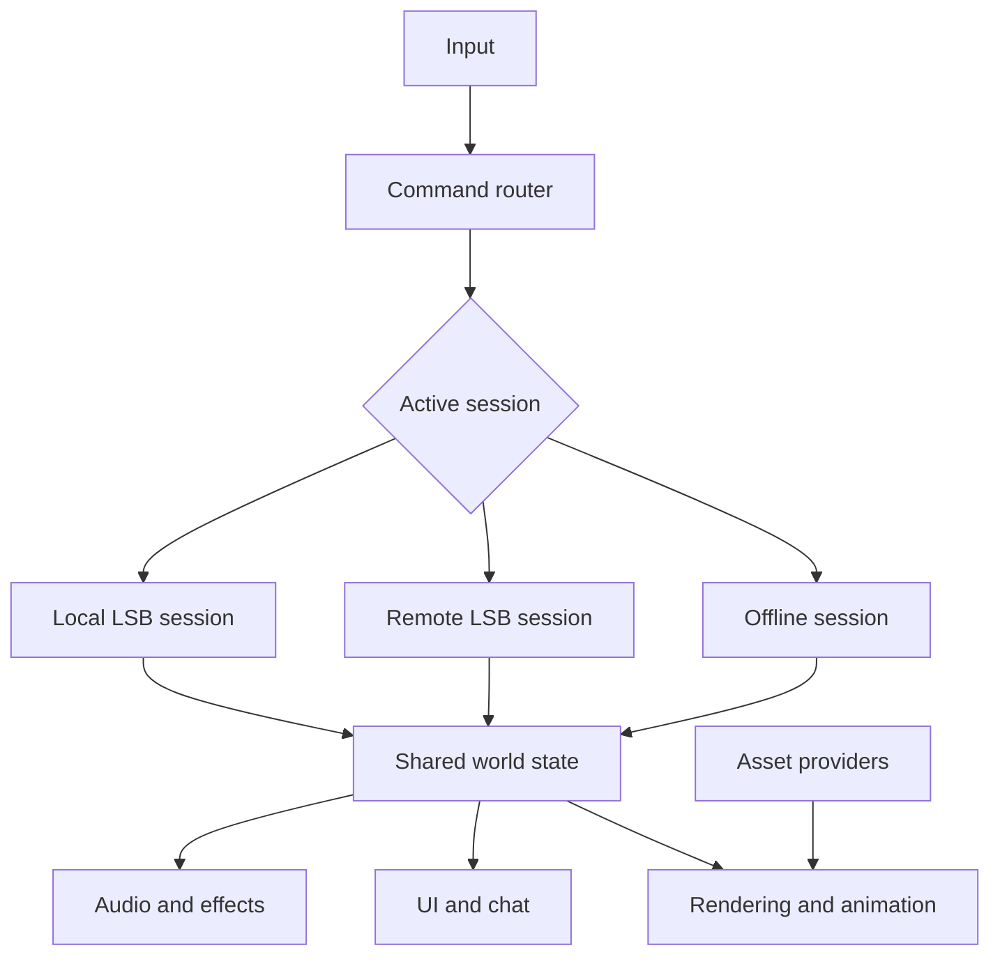

# DATura Offline and LandSandBoat Online Development Plan

**Project:** DATura  
**Document type:** Technical roadmap and implementation specification  
**Primary language:** C++  
**Status:** Planning baseline  
**Intended readers:** Human developers and AI coding agents with no prior conversation context

---

## 1. Executive Summary

DATura is an existing C++ application that can load and display Final Fantasy XI (FFXI) zones, render FFXI player-character models, allow a locally controlled player to walk through those zones, display and interact with NPCs, and present NPC dialogue and choices. It does not yet have a general player-chat client. It should now evolve from an offline asset viewer and exploratory client into a complete game-client runtime supporting three distinct usage modes:

1. **Offline single-player mode** — DATura runs the world locally without LandSandBoat (LSB), stores progress in local save files, and provides a deliberately single-player interpretation of FFXI gameplay.
2. **Remote online mode** — DATura acts as a network client for a remote LSB-compatible private server. The remote server is authoritative. A local LSB installation is not required.
3. **Local-server mode** — DATura connects to an LSB instance hosted on the player's computer or local network. DATura may detect, configure, launch, and monitor that installation, but LSB remains a separate server process.

The central architectural requirement is that rendering, animation, audio, input, UI, asset loading, and presentation code must not depend directly on whether DATura is offline or online. Each mode must implement a common session interface and feed a shared client-side world model. Player input must be expressed as commands; resulting world changes must be expressed as events or authoritative state updates.

The first major network milestone is not complete FFXI compatibility. It is a narrow vertical slice in which DATura connects to a local development LSB instance, authenticates, enters a zone DATura already renders, uses server data to spawn and position entities, synchronizes two players, and exchanges chat messages.

The first major offline milestone is a small, explicitly bounded single-player slice containing one city or hub, one adjacent field zone, basic enemies, combat, experience, inventory, equipment, NPC dialogue, a few quests, and save/load functionality. Attempting to reproduce every FFXI system before proving this slice is out of scope.

---

## 2. Existing Capabilities and Assumptions

### 2.1 Confirmed existing capabilities

The repository currently provides the following; Phase 0 must refresh this list if the implementation changes:

- Loading and displaying FFXI zones from user-provided DAT resources, including replacement-DAT support and diagnostic tooling.
- Rendering FFXI player characters, NPCs, nameplates, home points, environment effects, doors, and other supported zone objects.
- A locally controlled player with collision, ground following, jump, animation, camera, and data-driven zone transitions.
- Zone NPC catalogs, targeting, interaction distance, authored fallback dialogue, and partial retail event-script dialogue/choice playback. Retail event support is intentionally incomplete and is not yet a general quest authority.
- Existing starter-quest, home-point, door-interaction, transition, coordinate-frame, rendering, and player-control regression tests that can anchor the first offline slice.
- A native Windows C++/Direct3D application and build. Other operating systems are not currently supported targets unless a later portability effort establishes them.

Agents must inspect the actual repository before changing architecture. They must identify the concrete classes, filenames, third-party libraries, coordinate conventions, asset caches, and ownership rules already in use. Names used in this document such as `WorldState`, `IGameSession`, or `LSBConnection` are architectural placeholders, not instructions to create duplicate types when equivalent systems already exist.

### 2.2 Open questions requiring verification

The following remain open questions for Phase 0:

- Whether animation playback and skeleton support are complete enough for idle, walk, run, attack, reaction, and death states.
- Which existing chat-related controls are suitable for player-entered online chat, as opposed to the current NPC dialogue transcript and choice UI.
- Whether DATura has an explicit entity model or directly owns models inside rendering code.
- Whether zone loading is synchronous or asynchronous.
- Whether entity and resource identifiers already match FFXI or LSB identifiers.
- Whether DATura currently depends on a specific client build or private-server DAT set.
- Which windowing, rendering, input, audio, UI, networking, math, image, and serialization libraries are already present.
- Which existing quest/dialogue state is durable gameplay state and which is currently presentation-only or test scaffolding.

### 2.3 Terminology

- **DATura:** The C++ client/runtime described by this plan.
- **LSB / LandSandBoat:** The open-source FFXI server-emulator codebase.
- **Offline authority:** DATura code that simulates authoritative game rules locally.
- **Remote server:** An LSB-compatible server hosted by another party.
- **Local server:** An LSB instance hosted on the player's own system or LAN.
- **World state:** The client-visible collection of zones, entities, transforms, statistics, inventories, dialogue state, and related presentation data.
- **Command:** A player's requested action, such as move, attack, talk, use an item, or send chat.
- **Event:** A confirmed state transition presented to the client, such as an entity spawning, damage being applied, dialogue beginning, or inventory changing.
- **Client profile:** Metadata identifying the expected FFXI data generation, resource mappings, protocol compatibility, and optional server-specific behavior.

---

## 3. Product Goals

### 3.1 Primary goals

- Preserve and improve DATura's existing offline exploration capability.
- Make offline mode work without installing or running LSB.
- Allow DATura to connect to remote LSB-compatible private servers without requiring LSB locally.
- Optionally help players host or connect to a locally installed LSB instance.
- Reuse the same renderer, entity presentation, animation, UI, audio, and input systems across all modes.
- Keep offline characters and server-controlled characters separate by default.
- Provide clear compatibility diagnostics rather than silently failing on mismatched DATs, protocol versions, or server forks.
- Build narrow, testable vertical slices before broad feature coverage.
- Retain the option to support original assets and original game content later.
- Structure the code so gameplay behavior can be tested without rendering a full graphical frame.

### 3.2 Secondary goals

- Preserve an offline museum/viewer mode for developers and asset inspection.
- Support headless or scripted client sessions for automated tests.
- Support developer packet logging and replay.
- Allow server profiles for divergent private-server configurations.
- Make the system useful as a portfolio-quality demonstration of graphics, engine, tools, networking, and gameplay architecture.

### 3.3 Non-goals for the first vertical slice

- Complete compatibility with every LSB fork or private server.
- Perfect reproduction of all retail FFXI behavior.
- A general-purpose replacement for Unity or Unreal.
- A built-in LSB fork compiled into DATura.
- Automatic transfer of offline characters to public servers.
- Full auction house, linkshell, party, alliance, crafting, housing, PvP, or endgame support.
- Distribution of copyrighted FFXI assets.
- Rewriting working dependencies merely to make the project more custom.

---

## 4. Mode Definitions and User Experience

### 4.1 Offline single-player mode

Offline mode must always be available when required game assets are configured. It must not require LSB, Docker, network access, an account, or a server process.

Offline mode owns:

- Character creation or selection for offline saves.
- Local world simulation.
- NPC and enemy spawning.
- Combat resolution.
- Enemy AI.
- Quest and mission state.
- Inventory, equipment, currency, experience, and levels.
- Dialogue conditions.
- Local time, weather, and world flags.
- Save creation, migration, validation, backup, and restoration.

The first offline release may intentionally cover only a limited set of zones and systems. Unsupported zones or features must be labeled rather than implied to work.

### 4.2 Remote online mode

Remote online mode connects DATura to a remote LSB-compatible server. The server is authoritative for all meaningful gameplay state. DATura must not apply local save data to the server.

Remote online mode owns only client concerns:

- Connection configuration.
- Authentication flow.
- Packet transmission and receipt.
- Client-side prediction where necessary for responsiveness.
- Interpolation of remote movement.
- Presentation of server-confirmed state.
- Server-browser, direct-connect, favorites, and recent-server UI.

The remote server owns character data, combat results, NPC state, inventory, quests, currency, and persistence.

### 4.3 Local-server mode

Local-server mode connects to an LSB instance hosted by the player. From DATura's perspective, this is still an online/server-authoritative session. The extra responsibilities are process discovery and convenience tooling.

Optional capabilities include:

- Detecting Docker and/or an LSB installation.
- Detecting whether configured LSB services are running.
- Launching a user-approved local server configuration.
- Displaying logs and health status.
- Stopping only the process or container DATura started.
- Opening configuration and data directories.

DATura must never silently install, modify, start, stop, or delete server infrastructure without explicit user action. Local-server management should remain a separable optional module.

### 4.4 Proposed main menu

```text
Play Offline
    Continue
    New Offline Character
    Load Offline Save

Play Online
    Server Browser
    Direct Connect
    Favorites
    Recent Servers

Host or Use Local Server
    Start Configured Server
    Connect to Running Local Server
    Locate LandSandBoat
    Setup Instructions

Tools
    Zone Viewer
    Model Viewer
    Packet Replay

Settings
    Game Data
    Graphics
    Audio
    Controls
    Network
    Accessibility
```

If LSB is not installed, only local-hosting actions are disabled. Remote online play remains available.

---

## 5. Architectural Principles

### 5.1 Separate authority from presentation

Rendering code must not directly decide whether an attack hits, whether an item exists, or whether a quest advances. It displays confirmed or predicted state supplied by the active session.

Offline mode calculates authority locally. Online modes receive authority from LSB. Both write into the same client-facing world representation.

### 5.2 Express player intent as commands

Input systems should create commands rather than mutate game state directly.

Representative commands:

```cpp
struct MoveCommand;
struct ChangeHeadingCommand;
struct SelectTargetCommand;
struct InteractCommand;
struct AttackCommand;
struct UseAbilityCommand;
struct UseItemCommand;
struct EquipItemCommand;
struct SendChatCommand;
struct RequestZoneTransitionCommand;
```

In offline mode, the local authority validates and resolves commands. In online mode, the LSB session encodes and sends them, then applies server-confirmed results.

### 5.3 Present changes through a stable event/state boundary

Representative events:

```cpp
struct EntitySpawnedEvent;
struct EntityDespawnedEvent;
struct EntityTransformChangedEvent;
struct TargetChangedEvent;
struct ActionStartedEvent;
struct DamageAppliedEvent;
struct StatusChangedEvent;
struct DialogueStartedEvent;
struct InventoryChangedEvent;
struct ChatMessageReceivedEvent;
struct ZoneTransitionStartedEvent;
struct ZoneLoadedEvent;
```

Use events for transitions and a queryable `WorldState` for current truth. Avoid making the event stream the only durable representation of current state unless the project deliberately adopts event sourcing.

### 5.4 Preserve offline operation

Network code must be optional at runtime. Failing to locate LSB, losing internet access, or receiving an incompatible server profile must not prevent offline mode or developer tools from launching.

### 5.5 Prefer adapters over duplicated clients

Existing DATura systems should be moved behind interfaces incrementally. Do not create a parallel renderer, parallel NPC class hierarchy, or separate online UI application.

### 5.6 Do not prematurely generalize

Build interfaces around demonstrated variation: offline authority versus LSB authority, DAT assets versus future original assets, and local versus remote server endpoints. Do not create a universal engine plugin system before two real implementations require it.

---

## 6. Proposed Runtime Architecture

### 6.1 High-level components



### 6.2 Session interface

Adapt names to the existing codebase. The required conceptual boundary is:

```cpp
class IGameSession
{
public:
    virtual ~IGameSession() = default;

    virtual SessionStartResult Start(const SessionConfig& config) = 0;
    virtual void Stop() = 0;
    virtual void Tick(std::chrono::duration<float> deltaTime) = 0;
    virtual CommandResult Submit(const GameCommand& command) = 0;

    virtual SessionState GetState() const = 0;
    virtual const WorldState& GetWorldState() const = 0;
    virtual SessionDiagnostics GetDiagnostics() const = 0;
};
```

Suggested implementations:

- `OfflineGameSession`
- `LandSandBoatSession`
- `LocalLandSandBoatSession`, preferably as configuration/delegation around `LandSandBoatSession` rather than a duplicate network implementation
- `ReplaySession` for deterministic packet or event replay

### 6.3 Shared world state

The shared world model should contain presentation-ready but authority-neutral data:

```cpp
using EntityId = std::uint64_t;

struct EntityState
{
    EntityId id;
    EntityKind kind;
    std::string name;
    Transform transform;
    AppearanceDescriptor appearance;
    AnimationState animation;
    TargetingState targeting;
    VitalState vitals;
    StatusCollection statuses;
};

struct WorldState
{
    ZoneState zone;
    EntityRegistry entities;
    PlayerState localPlayer;
    InventoryView inventory;
    DialogueState dialogue;
    ChatHistory chat;
    EnvironmentState environment;
};
```

Do not expose raw network packet structures to rendering or UI code. Translate packets into domain data at the network boundary.

### 6.4 Entity identifiers

DATura should distinguish:

- Local runtime entity handle.
- Stable offline-save identifier.
- LSB/server entity identifier.
- Asset/model identifier.

Do not overload one integer for every purpose. Maintain explicit mappings inside the active session.

### 6.5 Coordinate conversion

Extend DATura's existing named coordinate-frame contract (`ffxi_coordinate_frame.h`) and its regression tests; do not introduce a second "canonical" coordinate layer. LSB packet decoding, physics, navigation, and rendering must use explicit conversions at subsystem boundaries. Preserve the existing distinction between authored/native zone space and scene/render space, including the documented scene-space Y reflection. Never scatter axis swaps, sign changes, heading conversions, or scale constants throughout the codebase.

Required tests should cover:

- FFXI/LSB position to DATura position and back.
- Heading units and wraparound.
- Zone origin assumptions.
- Model-space versus world-space transforms.
- Floating-point tolerance used for movement reconciliation.
- Agreement with existing coordinate, NPC-heading, transition, collision, water, and vegetation tests.

---

## 7. Offline Game Authority

### 7.1 Required subsystems

Offline mode eventually needs:

- Spawn and despawn rules.
- Player statistics and progression.
- NPC state.
- Enemy AI and aggro.
- Combat resolution.
- Abilities, spells, items, cooldowns, and status effects.
- Inventory, equipment, loot, currency, and shops.
- Dialogue, quest, and mission conditions.
- Time, weather, and world flags.
- Zone transitions.
- Save/load and version migration.

### 7.2 Scope the first offline slice

The first playable slice should deliberately constrain content:

- One hub or city district.
- One adjacent field zone.
- One player job or simplified class configuration.
- Three to five enemy types.
- Basic melee auto-attack or a small combat command set.
- Experience and level gain.
- A small inventory and equipment subset.
- One shop.
- Three to five NPCs with meaningful dialogue.
- Two or three quests.
- Save/load from the main menu and safe checkpoints.

Features not needed for the slice include auction houses, linkshells, parties, alliances, complex crafting, PvP, endgame systems, or exact retail balance.

### 7.3 Data-driven rules

Avoid hard-coding every NPC and quest in C++. Use structured data and/or a scripting layer already compatible with project constraints. Candidate categories include:

- Entity templates.
- Spawn tables.
- Dialogue graphs.
- Quest definitions.
- Loot tables.
- Item definitions.
- Ability definitions.
- Experience curves.

Choose the format after inspecting existing project dependencies. JSON, TOML, YAML, Lua, or a compact custom binary may all be reasonable. The important requirement is schema validation and clear errors.

### 7.4 Save-game design

Offline saves must include:

- Save format version.
- DATura application version.
- Content profile identifier and version.
- Player identity and appearance.
- Position and zone.
- Statistics, job/class state, inventory, equipment, currency, and experience.
- Quest and mission flags.
- World-state overrides.
- Play time and timestamps.
- Optional checksum for accidental corruption detection.

Use atomic saving: write a temporary file, flush and validate it, then replace the previous save. Keep at least one rotating backup. Migrations must be explicit and tested. Never silently discard unknown fields or overwrite a newer unsupported save.

### 7.5 Single-player-specific design opportunities

Offline mode may intentionally diverge from multiplayer FFXI through configurable features such as:

- Pause.
- Difficulty settings.
- Faster travel.
- Adjustable experience and drop rates.
- AI-controlled companions.
- Rebalanced encounters.
- Reduced real-time waiting.
- Save-anywhere or checkpoint saving.

Treat these as product decisions, not automatic requirements for the first slice.

---

## 8. LandSandBoat Network Integration

### 8.1 Network-layer responsibilities

The LSB integration layer should own:

- Endpoint resolution and socket lifecycle.
- Authentication and session establishment.
- Packet framing.
- Encryption, decryption, compression, checksums, or obfuscation where required.
- Packet encoding and decoding.
- Login, character selection, map/zone connection, and reconnection state machines.
- Translation between packet structures and DATura domain commands/events.
- Timeouts, retry policy, disconnect reasons, and diagnostics.
- Packet capture with credential and sensitive-data redaction.

### 8.2 Protocol implementation strategy

Do not attempt every packet at once. Implement protocol support in this order:

1. Connect and maintain socket lifecycle.
2. Authenticate a development account.
3. Enumerate or select a character.
4. Establish map/zone session.
5. Receive local-player identity and position.
6. Receive nearby entity spawns.
7. Send local movement.
8. Receive remote movement.
9. Send and receive chat.
10. Select targets and interact with NPCs.
11. Receive dialogue and menu state.
12. Initiate and present combat.
13. Synchronize inventory and equipment.
14. Handle zone transitions.
15. Add parties and other advanced systems.

Each packet family must have fixtures and parser tests before it drives production world state.

### 8.3 State machine

Implement explicit connection states rather than scattered booleans:

```text
Disconnected
ResolvingEndpoint
ConnectingLogin
Authenticating
SelectingCharacter
ConnectingMap
EnteringZone
SynchronizingWorld
InWorld
ChangingZone
Reconnecting
Disconnecting
Failed
```

Transitions must record a reason and timestamp. Unexpected packets should be logged and safely ignored or terminate the session with a useful error, depending on severity.

### 8.4 Movement

For the initial version:

- Keep local controls responsive.
- Send movement at a measured, configurable cadence.
- Store the last server-confirmed transform.
- Interpolate remote players between updates.
- Correct the local player only when error exceeds defined thresholds.
- Treat teleports and zone transitions as explicit discontinuities.
- Do not invent complex rollback networking for an FFXI-style movement model.

Record movement packet traces and create deterministic replay tests.

### 8.5 Chat

Reuse suitable presentation primitives from the existing NPC transcript UI, but treat multiplayer chat as a distinct feature. Add session-independent chat commands/events plus dedicated text entry, channel selection, scrolling history, and focus behavior. Support progressively:

- System messages.
- Say.
- Tell.
- Party and linkshell channels when the corresponding systems exist.
- Sender name and identifier.
- Channel styling.
- Input length and encoding rules.
- Spam/rate limiting consistent with server behavior.

Sanitize rendered text. Remote messages and server-provided names are untrusted input.

### 8.6 Private-server compatibility profiles

Different LSB forks may expect different client versions, packets, resource IDs, or custom behavior. Define a server profile containing at least:

```cpp
struct ServerProfile
{
    std::string id;
    std::string displayName;
    std::string host;
    std::uint16_t loginPort;
    std::string protocolProfile;
    std::string requiredContentProfile;
    std::string expectedClientBuild;
    bool allowInsecureTransport;
};
```

Do not pretend universal compatibility. Start with one pinned development LSB revision and one known DAT/client profile. Add additional profiles only after automated compatibility tests exist.

### 8.7 Custom-client permission

Server operators determine whether custom clients are allowed. DATura should make no promise that compatibility implies permission. Server profiles may include a notice or rules URL. Users should be encouraged to obtain permission before testing DATura on third-party servers.

---

## 9. Local LandSandBoat Hosting Integration

### 9.1 Detection

Local-server detection may check user-configured paths, environment-specific installation metadata, Docker availability, and known process/container names. Never recursively scan broad user directories without consent.

### 9.2 Process ownership

DATura may stop only processes or containers it started and can positively identify. It must not terminate an independently managed server simply because it uses a familiar executable name or port.

### 9.3 Setup options

The first release may provide documentation and a path picker rather than automated installation. Later versions can offer:

- Validated configuration templates.
- Docker Compose integration.
- Health checks.
- Log viewing.
- Local account creation helpers.
- Backup reminders.

Any database mutation or destructive operation must require explicit confirmation and backups where applicable.

### 9.4 Failure behavior

If local LSB is missing or unhealthy:

- Offline mode remains available.
- Remote online mode remains available.
- The launcher reports the failed check and remediation steps.
- DATura does not repeatedly modify configuration in an attempt to self-repair.

---

## 10. Asset and Content Profiles

### 10.1 Do not redistribute FFXI assets

DATura must require users to point to legitimately obtained client data. Project releases, test fixtures, screenshots, and automated build artifacts must not accidentally contain copyrighted game assets.

### 10.2 Content profile

Define a content profile that describes:

- Game-data root.
- Client build/hash information.
- VTABLE/FTABLE or equivalent mapping identity.
- Known resource-layout generation.
- Zone and model compatibility.
- Optional server association.
- Original/custom asset overlays.

### 10.3 Future original assets

The runtime should eventually support original assets without forcing them into FFXI DAT formats. Keep asset identity independent from file format. A future `IAssetProvider` may support:

- FFXI DAT provider.
- Native glTF/GLB provider.
- Development loose-file provider.
- Packed-release provider.

This is not required for the first LSB connection milestone, but new networking code must not hard-code renderer dependencies on DAT file locations.

---

## 11. Character and Save Separation

### 11.1 Offline characters

Offline characters belong to DATura and are stored in local saves.

### 11.2 Online characters

Online characters belong to the selected server and are stored in that server's database. DATura stores only non-authoritative preferences such as recent character selection, camera settings, hotbars where permitted, and UI layout.

### 11.3 Local-server characters

Characters on a locally hosted LSB instance are still server characters. Their authoritative data belongs to the local LSB database, not DATura save files.

### 11.4 Import and export

Do not automatically upload offline progress to a server. Any future conversion tool must be an explicit administrator operation with validation, audit output, and server-specific rules. Public servers must be able to reject imports completely.

---

## 12. Security and Privacy

### 12.1 Treat remote input as untrusted

Validate all lengths, counts, identifiers, encodings, and enum values before allocating memory or updating state. Packet parsers must be fuzzable and must fail safely on truncated or malformed data.

### 12.2 Credentials

- Never write plaintext credentials to normal logs.
- Do not include credentials in packet captures shared by default.
- Use the operating system's credential storage when practical.
- Clearly warn if the FFXI-compatible protocol cannot provide modern transport security.
- Avoid silently reusing credentials across unrelated server profiles.

### 12.3 File safety

- Canonicalize user-selected paths.
- Do not permit server packets to select arbitrary filesystem paths.
- Validate downloaded metadata before use.
- Keep mods and server-provided content outside executable directories when possible.
- Never execute server-supplied scripts or binaries automatically.

### 12.4 Local server safety

- Bind development servers to localhost by default.
- Explain firewall exposure before opening LAN or internet access.
- Generate unique development credentials.
- Avoid shipping default administrative passwords.

---

## 13. Testing Strategy

### 13.1 Unit tests

Prioritize tests for:

- Coordinate and heading conversion.
- Packet framing.
- Packet parsers and encoders.
- Save serialization and migration.
- Inventory rules.
- Combat calculations.
- Quest conditions.
- Server-profile validation.
- Content-profile detection.

### 13.2 Golden packet fixtures

Capture known-good, sanitized packet sequences from an authorized local development environment. Store compact fixtures containing no credentials or copyrighted assets. Tests should verify both parsing and re-encoding where appropriate.

### 13.3 Replay sessions

Implement a replay mode that reads timestamped domain events or sanitized packets. This allows rendering and UI debugging without running LSB and makes AI-agent changes reproducible.

### 13.4 Integration tests

Provide a pinned local development LSB configuration used only for tests. Automate, where practical:

- Server health check.
- Test-account creation.
- Login.
- Character selection.
- Zone entry.
- Entity receipt.
- Chat round trip.
- Movement update.
- Clean shutdown.

### 13.5 Two-client test

The first multiplayer acceptance test requires two DATura clients connected to the same development server. Each client must:

- Enter the same zone.
- See the other player.
- Receive movement updates.
- Exchange chat.
- Disconnect without corrupting the other session.

### 13.6 Offline deterministic tests

Use a fixed random seed and fixed timestep for combat, AI, loot, and quest tests. Rendering must not be required to test authority rules.

### 13.7 Fuzzing

Fuzz packet parsers, save loaders, and custom content manifests. These are high-risk boundaries exposed to malformed or adversarial data.

---

## 14. Logging and Diagnostics

Use structured logging with categories and severity levels:

- `session`
- `network`
- `packet`
- `world`
- `entity`
- `asset`
- `zone`
- `offline`
- `save`
- `ui`
- `local_server`

Provide a user-exportable diagnostics package containing versions, enabled profile identifiers, sanitized logs, and configuration metadata. Exclude credentials, chat history by default, personally identifying information, and copyrighted assets.

Packet logging must support:

- Direction.
- Timestamp.
- Opcode or packet type.
- Declared and actual length.
- Connection/session phase.
- Optional decoded summary.
- Redaction policy.

---

## 15. Phased Implementation Roadmap

### Phase 0 — Repository audit and baseline preservation

**Objective:** Understand current DATura architecture and prevent regressions.

Tasks:

- Build DATura from a clean checkout.
- Document dependencies and supported platforms.
- Locate zone, character, NPC, movement, animation, and chat code.
- Document ownership and update flow for current world objects.
- Record current screenshots or short test captures.
- Add smoke tests or scripted manual steps for existing functionality.
- Identify current coordinate conventions.
- Pin a known LSB development revision and compatible game-data profile.

Deliverables:

- `docs/architecture/current-state.md`
- `docs/building.md`
- Baseline smoke-test checklist
- Initial risk and dependency inventory

Exit criteria:

- A new agent can build and run DATura.
- Existing zone exploration, character movement, NPC display, and NPC dialogue/choice UI still work.

### Phase 1 — Shared session and world-state seam

**Objective:** Put existing offline behavior behind stable interfaces without changing visible behavior.

Tasks:

- Introduce or formalize `WorldState`.
- Introduce command and event vocabulary.
- Add `IGameSession` or adapt an equivalent abstraction.
- Implement `OfflineGameSession` using existing behavior.
- Remove direct input-to-render-state mutations where necessary.
- Add session lifecycle and diagnostics.

Exit criteria:

- Existing offline exploration works through `OfflineGameSession`.
- Rendering and UI do not depend on a concrete network session.
- Offline mode starts when no LSB installation exists.

### Phase 1.5 — Local authority proof

**Objective:** Prove that the session boundary supports real authoritative gameplay before committing it to the network implementation.

Tasks:

- Route one existing NPC interaction or starter-quest scenario through commands and authority-neutral state/events.
- Keep the first `WorldState` implementation conservative: prefer a read-only snapshot or adapter over existing state before moving ownership.
- Add only the minimum durable local state needed by the scenario, with deterministic tests.
- Verify that viewer, diagnostics, DAT replacement, NPC dialogue, home-point, and zone-transition workflows still launch and behave as before.

Exit criteria:

- One small gameplay state transition is validated by local authority and presented through the same boundary intended for online state.
- The spike identifies which state must move out of `main.cpp` and which presentation state can remain in place.
- No save-format commitment or broad entity rewrite is required to pass this phase.

### Phase 2 — Network foundation

**Objective:** Establish reliable packet transport and observable protocol state.

Tasks:

- Build a standalone protocol lab first, separate from production world state, for transport, framing, redacted traces, and fixture replay.
- Implement socket ownership and asynchronous I/O strategy.
- Implement connection-state machine.
- Implement packet framing and sanitized logging.
- Add packet fixtures and parser tests.
- Connect to the pinned local LSB environment.
- Reach authentication and character selection.

Exit criteria:

- DATura can connect and authenticate using a development account.
- Failures report actionable state and reason.
- No credentials appear in standard logs.
- Captured or synthetic fixtures replay deterministically without launching the renderer.

### Phase 3 — Enter a server-controlled zone

**Objective:** Use server state to drive a zone DATura already supports.

Tasks:

- Complete map/zone handshake.
- Load the server-selected zone.
- Apply authoritative player identity, appearance, and initial transform.
- Spawn nearby NPCs/entities from server data.
- Map server IDs to runtime entities.
- Handle spawn, update, and despawn.

Exit criteria:

- DATura enters one pinned test zone.
- Player and NPC placement come from server state.
- Unexpected packets do not crash the client.

### Phase 4 — Multiplayer movement and chat

**Objective:** Deliver the first socially functional multiplayer slice.

Tasks:

- Send local movement and heading.
- Receive server corrections.
- Receive and interpolate remote-player movement.
- Connect chat input to outgoing packets.
- Present incoming chat through the new session-independent chat UI.
- Run two-client integration tests.

Exit criteria:

- Two DATura clients see one another move.
- Both clients exchange chat.
- Disconnecting one client does not destabilize the other.

### Phase 5 — NPC interaction and combat presentation

**Objective:** Complete one authoritative gameplay loop.

Tasks:

- Target entities.
- Send interaction and attack commands.
- Receive dialogue/menu state.
- Receive actions, damage, status, and death information.
- Map action results to animations and effects.
- Display player and target vitals.

Exit criteria:

- Player can talk to one NPC.
- Player can target and defeat one supported enemy under LSB authority.
- Client state reconciles correctly after combat.

### Phase 6 — Online inventory, equipment, and zone transitions

**Objective:** Make the online client usable beyond a single encounter.

Tasks:

- Synchronize inventory and equipment.
- Update appearance from equipment state.
- Implement basic item use.
- Handle doors and zone transitions.
- Persist server profiles and recent connections.
- Add compatibility diagnostics.

Exit criteria:

- Player can change zones, equip a supported item, and reconnect without client corruption.

### Phase 7 — Complete the offline vertical slice

**Objective:** Provide a standalone, saveable single-player RPG slice.

Tasks:

- Implement local combat authority.
- Add local enemy AI and spawning.
- Add experience, levels, inventory, equipment, loot, and shops.
- Expand the Phase 1.5 dialogue/quest authority into the bounded hub-and-field scenario; do not assume the partial retail event interpreter is a complete quest engine.
- Implement atomic save/load with versioning.
- Add one hub and one field zone worth of supported content.

Exit criteria:

- A player can begin a new offline game, complete quests and combat, save, quit, reload, and continue without LSB or network access.

### Phase 8 — Local-server convenience

**Objective:** Improve self-hosting without coupling core client operation to LSB installation.

Tasks:

- Add explicit LSB path/configuration UI.
- Add health checks and logs.
- Add safe start/stop for DATura-owned local processes or containers.
- Add local account setup documentation or helpers.

Exit criteria:

- A user with a valid configured LSB installation can launch or connect to it from DATura.
- Users without LSB can still use offline and remote-online modes.

### Phase 9 — Hardening and expansion

Tasks:

- Fuzz parsers.
- Improve accessibility and input remapping.
- Add crash recovery and diagnostics export.
- Expand server compatibility only with tests.
- Expand offline content iteratively.
- Begin native/original asset-provider work if desired.

---

## 16. Prioritized Backlog

### Must have

- Clean baseline build and documentation.
- Shared world state.
- Session abstraction.
- Existing behavior preserved in offline exploration mode.
- Pinned LSB development environment.
- Authentication and zone entry.
- Server-driven entity spawning.
- Multiplayer movement.
- Chat round trip.
- One NPC interaction and one combat encounter.
- Offline save format and limited gameplay authority.

### Should have

- Packet replay.
- Two-client automated integration harness.
- Compatibility profiles.
- Inventory/equipment synchronization.
- Zone transitions.
- Local-server detection and health checks.
- Diagnostics export.

### Could have

- Server browser discovery service.
- AI companions in offline mode.
- Original glTF assets.
- Mod packaging.
- Local-server automated setup.
- Rich packet inspector UI.

### Explicitly deferred

- Universal private-server compatibility.
- Offline-to-public-server character uploads.
- General-purpose visual game editor.
- Complete reproduction of retail FFXI.

---

## 17. Risks and Mitigations

| Risk | Impact | Mitigation |
|---|---|---|
| Protocol behavior is undocumented or fork-specific | High | Pin one LSB revision; build fixtures; use authorized local captures; add profiles later. |
| Existing code couples entities directly to rendering | High | Refactor incrementally behind `WorldState`; preserve smoke tests. |
| Coordinate or heading mismatches | High | Extend the existing coordinate-frame contract and regression suite; test packet-boundary round trips. |
| Attempting complete FFXI coverage stalls progress | High | Enforce narrow vertical slices and explicit unsupported-feature lists. |
| Offline logic duplicates server behavior | Medium | Share domain data and command vocabulary, not necessarily implementation; test both modes against common scenarios. |
| Private servers reject custom clients | Medium | Require operator permission; make profiles explicit; prioritize local development. |
| Malformed packets compromise the client | High | Validate input; fuzz parsers; isolate raw packets from domain state. |
| Save-format changes corrupt progress | High | Version, migrate, validate, save atomically, and retain backups. |
| LSB and client data versions diverge | High | Content/client profiles, hashes, compatibility diagnostics, pinned test environment. |
| Scope expands into a universal engine | High | Build the DATura product first; generalize only proven reusable systems. |
| Copyrighted assets enter releases or tests | High | Require user-provided data; audit artifacts; use synthetic fixtures. |
| GPL obligations are misunderstood | High | Track provenance; keep license notices; obtain legal review before commercial distribution. |

---

## 18. Licensing and Legal Considerations

This section is project-planning guidance, not legal advice.

- Do not distribute Square Enix DAT files, models, textures, animations, music, dialogue, or other copyrighted game content.
- Require users to identify their own legally obtained game-data installation.
- Keep synthetic protocol fixtures free of copyrighted expressive content.
- The upstream LandSandBoat server repository identifies itself as GNU GPL v3. Verify the license at the pinned revision and comply with it when modifying, copying, linking, or distributing covered material.
- Network interoperability does not itself grant permission to copy LSB implementation code, packet tables, generated artifacts, comments, tests, or fixtures into DATura. Record the source and license of every imported artifact before it enters the repository.
- A separately developed client communicating over a network is different from copying or linking server code, but this plan does not determine whether a particular implementation is derivative; distribution and commercial decisions require qualified legal review.
- Do not copy Kuluu source into DATura unless the project intentionally accepts the resulting licensing obligations and records provenance.
- Reverse engineering, private-server use, trademarks, and end-user license agreements may present separate legal questions beyond source-code licensing.
- Avoid branding DATura as official or endorsed by Square Enix or private-server operators.

Maintain the existing `THIRD_PARTY_NOTICES.md` file and a dependency/license inventory from Phase 0 onward. Add a short provenance record for protocol references and fixtures, even when no third-party code is copied.

---

## 19. AI Agent Working Protocol

Every AI agent working on DATura must follow these rules:

1. Read this plan and repository-local instructions before acting.
2. Build and run relevant tests before editing when feasible.
3. Inspect existing abstractions before creating new ones.
4. Make the smallest coherent change that advances one acceptance criterion.
5. Do not rename broad subsystems or perform mass rewrites without an approved migration plan.
6. Do not copy code from Kuluu, LSB, or other repositories without checking license compatibility and recording provenance.
7. Never include real credentials or unredacted authentication captures in commits, logs, fixtures, or prompts.
8. Never add copyrighted FFXI assets to the repository.
9. Add tests for packet parsing, coordinate conversions, save migrations, and authority rules.
10. Preserve offline functionality when changing network code.
11. Preserve online isolation when changing offline save logic.
12. Document uncertain protocol assumptions in code and issue notes.
13. Report exact build commands, tests executed, failures, and unresolved risks in handoff notes.
14. Do not claim server compatibility without testing the named revision/profile.
15. Do not silently broaden task scope.

### Required agent task template

Before implementation, an agent should state:

```text
Objective:
Relevant phase and acceptance criterion:
Files/subsystems inspected:
Assumptions:
Planned minimal change:
Tests to add or run:
Licensing/security concerns:
```

After implementation, an agent should report:

```text
Outcome:
Files changed:
Behavior added or modified:
Tests run and results:
Manual verification:
Known limitations:
Recommended next task:
```

---

## 20. Decision Log

### Accepted decisions

1. DATura will support offline and online operation in the same client application.
2. Offline mode will not require LSB.
3. Connecting to a remote private server will not require a local LSB installation.
4. Local hosting will remain an optional capability layered around the online client.
5. Offline and online characters will remain separate by default.
6. Shared presentation systems will consume a common world state.
7. Commands and events will separate player intent from authority.
8. The first network target will be one pinned LSB revision and one compatible content profile.
9. The first offline target will be a deliberately limited vertical slice.
10. DATura will be developed first as a purpose-built client/runtime, not a universal engine.

### Open decisions

- Exact asynchronous networking library and threading model.
- Exact serialization format for offline saves.
- Whether offline rules use C++, Lua, or another data/scripting arrangement.
- Whether the existing entity system can become `WorldState` or requires an adapter.
- Exact protocol/client revision selected for the first LSB target.
- Whether local-server support initially targets Docker only, native installs only, or both.
- How client updates and profile migrations will be distributed.
- Whether original assets will use glTF directly or an intermediate packaged format.

Record future architectural decisions in dated ADRs rather than silently revising assumptions.

---

## 21. Definition of the First Successful Release

The first meaningful DATura release under this plan succeeds when all of the following are true:

### Offline

- DATura launches with no LSB installation and no network connection.
- The player can load a supported zone, move, see NPCs, perform at least one combat encounter, complete at least one quest, save, quit, reload, and continue.

### Remote/local online

- DATura can authenticate against the pinned LSB development target.
- It can enter a supported zone using server-authoritative identity and position.
- It can spawn and update server-provided entities.
- Two DATura clients can see one another move and exchange chat.
- The player can interact with one NPC and complete one combat encounter.

### Reliability and safety

- Offline saves are versioned, atomic, and backed up.
- Credentials are absent from normal logs.
- Malformed packet fixtures do not crash or over-allocate the client.
- Existing DATura viewer/exploration functionality has not regressed.
- Releases contain no FFXI assets.
- Build and test instructions are sufficient for a new contributor or AI agent.

---

## 22. Immediate Next Actions

Execute these tasks in order:

1. Audit the current DATura repository and write `docs/architecture/current-state.md`.
2. Record a clean build and existing-feature smoke test.
3. Select and pin the first LSB development revision and matching game-data profile; record the exact commit and protocol-reference provenance.
4. Identify the current entity ownership model and define the smallest read-only `WorldState` adapter over existing state.
5. Route existing offline exploration through an initial session abstraction without changing behavior.
6. Prove the boundary with one existing NPC interaction or starter-quest state transition under local authority.
7. Create a minimal standalone networking experiment that connects to the local LSB login endpoint and logs sanitized packet framing without mutating production world state.
8. Extend the existing coordinate-frame tests with LSB position and heading fixtures before applying server transforms to rendered entities.
9. Implement authentication and zone entry incrementally.
10. Stop and reassess architecture after the first server-controlled player appears in a DATura-rendered zone.

The reassessment must compare actual effort against this plan, update estimates, identify coupling revealed by the implementation, and decide whether to continue toward multiplayer movement or first strengthen the shared world-state boundary.

---

## 23. Final Direction

DATura should become one multi-mode FFXI-compatible client/runtime rather than separate offline and online applications. Its existing rendering, zone, character, NPC, movement, and dialogue foundations should be preserved. Offline mode should provide a self-contained local authority and save system. Online mode should translate LandSandBoat protocol traffic into the same world representation. Local hosting should be a convenience layer, not a prerequisite for online play.

The project should advance through small end-to-end slices: first a local-authority proof through the shared boundary, then server connection and server-controlled zone entry, then two-player movement and chat, then one online NPC/combat loop, followed by completion of the bounded offline RPG slice. This sequence exercises the architecture in both authority modes early while steadily converting DATura into the full game client envisioned by the project.
